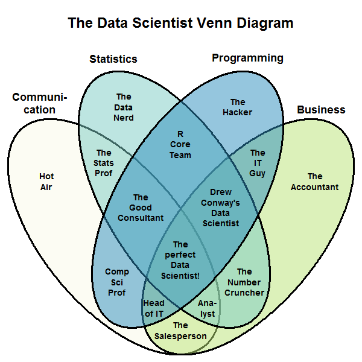
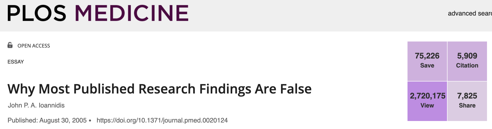
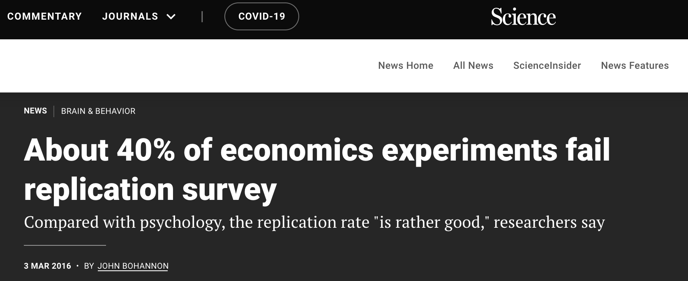
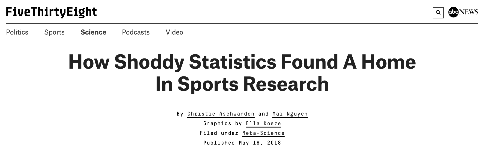
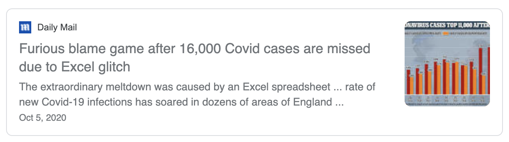
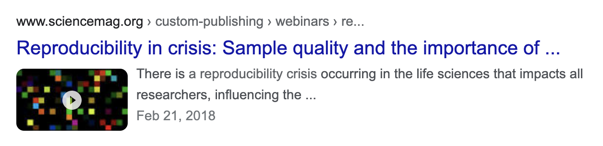
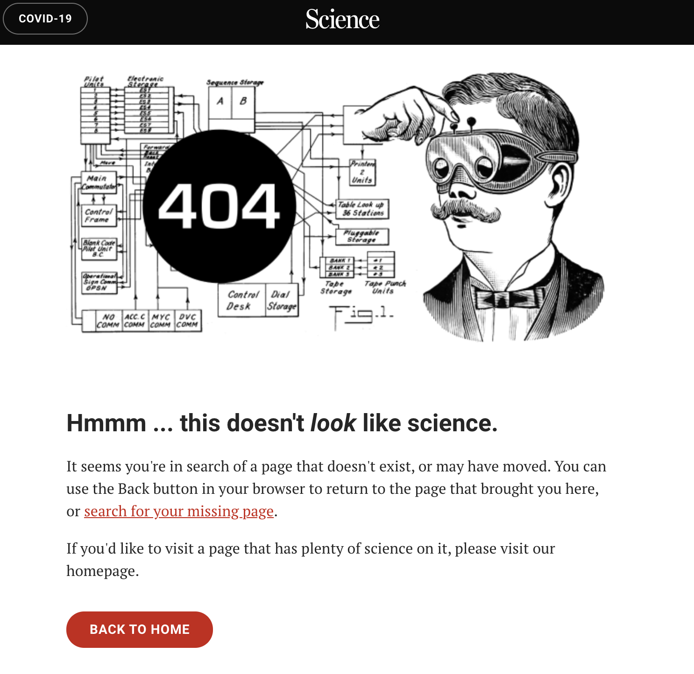
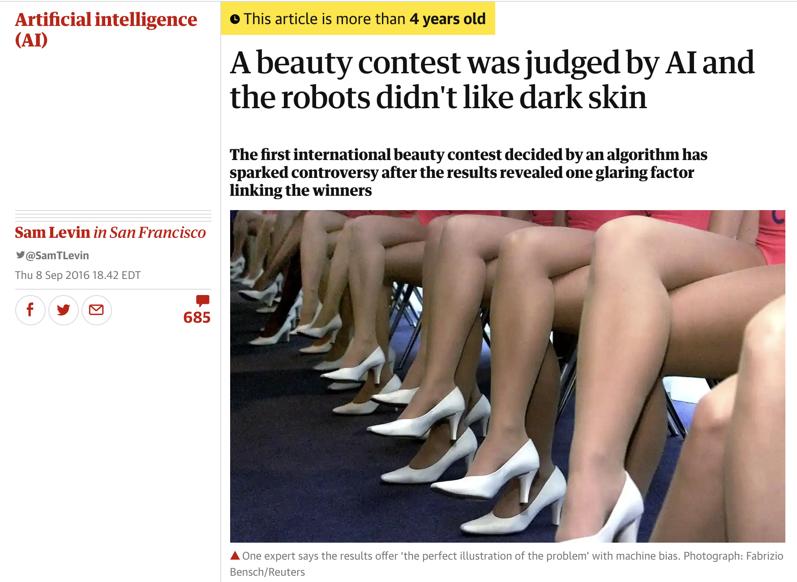
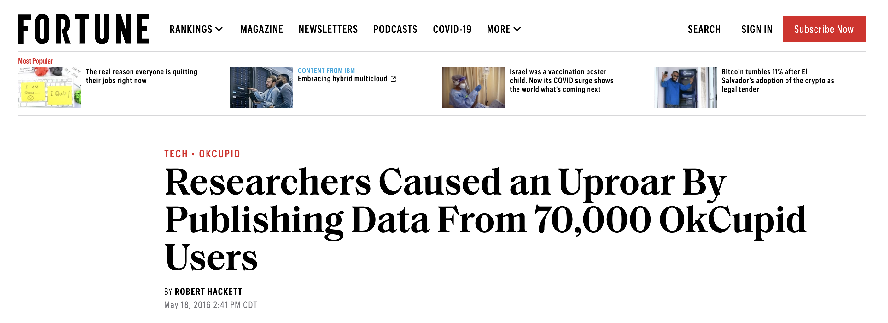

--- 
title: www.datascience.pizza
site: bookdown::bookdown_site
output: bookdown::gitbook
documentclass: book
bibliography: [book.bib, packages.bib]
biblio-style: apalike
link-citations: yes
github-repo: databrew/intro-to-data-science
description: "A resource & workbook for the Sewanee DataLab"
favicon: img/favicon.ico
always_allow_html: true
params:
  is_teacher: TRUE
---


```{r setup, include=FALSE, echo = FALSE}
# Basic knitr options
library(knitr)
opts_chunk$set(comment = NA, 
               echo=FALSE,
               warning = FALSE, 
               message = FALSE, 
               error = TRUE, 
               cache = FALSE,
               fig.width = 9.64,
               fig.height = 5.9,
               fig.path = 'figures/')
options(scipen=999)
is_teacher <- params$is_teacher

```

```{r,echo=FALSE,eval=FALSE}
codejs <- readr::read_lines("./js/codefolding.js")
collapsejs <- readr::read_lines("./js/collapse.js")
transitionjs <- readr::read_lines("./js/transition.js")
dropdownjs <- readr::read_lines("./js/dropdown.js")

htmlhead <- c(
  paste('
<script>',
paste(transitionjs, collapse = "\n"),
'</script>
<script>',
paste(collapsejs, collapse = "\n"),
'</script>
<script>',
paste(codejs, collapse = "\n"),
'</script>
<script>',
paste(dropdownjs, collapse = "\n"),
'</script>
<style type="text/css">
.code-folding-btn { margin-bottom: 4px; }
.row { display: flex; }
.collapse { display: none; }
.in { display:block }
.pull-right > .dropdown-menu {
    right: 0;
    left: auto;
}
.open > .dropdown-menu {
    display: block;
}
.dropdown-menu {
    position: absolute;
    top: 100%;
    left: 0;
    z-index: 1000;
    display: none;
    float: left;
    min-width: 160px;
    padding: 5px 0;
    margin: 2px 0 0;
    font-size: 14px;
    text-align: left;
    list-style: none;
    background-color: #fff;
    -webkit-background-clip: padding-box;
    background-clip: padding-box;
    border: 1px solid #ccc;
    border: 1px solid rgba(0,0,0,.15);
    border-radius: 4px;
    -webkit-box-shadow: 0 6px 12px rgba(0,0,0,.175);
    box-shadow: 0 6px 12px rgba(0,0,0,.175);
}
</style>
<script>
$(document).ready(function () {
  window.initializeCodeFolding("show" === "show");
});
</script>
', sep = "\n"),
  paste0('
<script>
document.write(\'<div class="btn-group pull-right" style="position: absolute; top: 20%; right: 2%; z-index: 200"><button type="button" class="btn btn-default btn-xs dropdown-toggle" data-toggle="dropdown" aria-haspopup="true" aria-expanded="true" data-_extension-text-contrast=""><span>Code</span> <span class="caret"></span></button><ul class="dropdown-menu" style="min-width: 50px;"><li><a id="rmd-show-all-code" href="#">Show All Code</a></li><li><a id="rmd-hide-all-code" href="#">Hide All Code</a></li></ul></div>\')
</script>
')
)

readr::write_lines(htmlhead, path = "header.html")
```

```{r,eval=TRUE,echo=FALSE}
# Define function for showing teacher content
teacher_content <- function(content = ''){
  cat(paste0('<p style="color:#3f0000; background-color:#f5f5dc"> <b>Instructor tip!</b><br>', content, '</p>'))
}
```

# Welcome!


## What this is, and what it isn't {-}

This is not a textbook or an encyclopedia. This is not a reference manual. It is not exhaustive or comprehensive. We barely mention statistical tests at all. There is almost no theory. In fact, this curriculum is biased, non-representative, and incomplete -- *by design.* 

**So what is this?** This guide is an *accelerator,* an *incubator* designed to guide you along the most direct path from your first line of code to becoming a capable data scientist. Our goal is to help you through the most dangerous period in your data science education: your very first steps. The first three weeks. That is when 99% percent of people give up on learning to code.  

But it doesn't need to be this way. We made this book to reach more than just the 1%.  

We have based our approach on three core premises:

**Premise 1: We learn best by doing.** Our goal is to get you *doing* data science. We will keep theory and detail to a minimum. We will give you the absolute basics, then offer you exercises and puzzles that motivate you to learn the rest. Then, once you've been *doing* data science for a bit, you soon begin *thinking* like a data scientist. By that, we mean tackling ambiguous problems with persistence, independence, and creative problem solving.   

**Premise 2: We learn best with purpose.** Once you gain comfort with the basic skills, you will be able to start working on real data, for real projects, with real impact. You will start to *care about what you are coding*. And that is when the learning curve *skyrockets* -- because you are motivated, and because you are learning *reactively*, instead of preemptively. Our goal is to get you to the point of take-off as quickly as possible.  

**Premise 3: A simple toolbox is all you need to build a house.** Once you become comfortable with a few basic coding tools, you can build pretty much anything. The toolbox doesn't need to be that big; if you know how to use your tools well, and if you have enough building supplies (i.e., data), the possibilities are limitless.  


**One more thing that this is not:** This is not a fancy interactive tutorial with bells or whistles. We purposefully designed this to be simple and "analog". You will not be typing your code into this website and getting feedback from a robot, or setting up an account to track your progress, or getting pretty merit badges or points when you complete each module.  

Instead, you will be doing your work on your *own machine*, working with *real folders and files*, downloading data and moving it around, etc. -- all the things you will be doing as a real data scientist in the real world.


## Who this is for {-}

This curriculum covers everything from the absolute basics of writing code in `R` to machine learning. As such, it is designed to be useful to everyone in some way. But the target audience for these tutorials is the *rookie*: the student who *wants* to work with data but has *zero* formal training in programming, computer science, or statistics.  

This curriculum was originally developed for the [**DataLab**](https://new.sewanee.edu/sewanee-datalab/) at Sewanee: The University of the South, TN, USA.


## What you will learn {-}

- The **Core theory** unit establishes the conceptual foundations and motivations for this work: what data science is, why it matters, and ethical issues surrounding it: the good, the bad, and the ugly. Don't slog through this all at once. Sprinkle it in here and there. The most important thing, at first, is to start writing code.


The next several units comprise a *core* curriculum for tackling data science problems:  

- The **Getting started** unit teaches you how to use `R` (in `RStudio`). Here you will add the first and most important tools to your toolbox: working with variables, vectors, dataframes, scripts, and file directories.  

- The **Basic `R` workflow** unit teaches you how to bring in your own data and work with it in `R`. You will learn how to produce beautiful plots and how to reorganize, filter, and summarize your datasets. You will also learn how to conduct basic statistics, from exploratory data analyses (e.g., producing and comparing distributions) to significance testing. 

For these first two units, we encourage you to take on these modules one at a time, in the exact order they are presented: we put a lot of thought into what we included in these modules (and what we did not).

- The **Review exercises** unit provides various puzzles that allow you to apply the basic `R` skills from the previous unit to fun questions and scenarios. In each of these exercises, questions are arranged in increasing order of difficulty, so that beginners will not feel stuck right out of the gate, nor will experienced coders become bored. This is where you really begin to cut your teeth on real-world data puzzles: figuring out how to use the `R` tools in your toolbag to tackle an ambiguous problem and deliver an excellent data product.  

- The **Reproducible research** unit equips you with basic tools needed for truly reproducible data science: documenting your research and code with `Markdown`; weaving together your code and your reporting with `RMarkdown`; 
allowing users to explore the data themselves with an interactive `Shiny` dashboard or web app; and sharing your code and tracking versions of your code using `Git`.  

- The **Presenting research** unit teaches you how to produce well-organized and well-written research reports, and how to deliver compelling presentations about your work.  

- The final unit, **Deep `R`**, introduces you to a variety of more involved `R` tools and advanced data science techniques, from writing custom functions and `for` loops to producing interactive maps, iterative simulations, and machine learning algorithms. These modules are designed to be used *as needed*, in whatever order is most helpful for you in your own work. 


## Contributors {-}

**Eric Keen** is a data scientist, marine ecologist, and educator. He is the Science Co-director at [BCwhales](www.bcwhales.org), a research biologist at [Marecotel](www.marecotel.org), a data scientist at [Hyfe](www.hyfe.ai), and a professor of Environmental Studies at Sewanee: the University of the South. He earned his BA at Sewanee (2008) and his PhD at Scripps Institution of Oceanography (2017). His [research](https://scholar.google.com/citations?hl=en&user=SrLDYrEAAAAJ&view_op=list_works&sortby=pubdate) focuses on the ecology and conservation of whales in developing coastal habitats. He is passionate about whales, conservation, teaching, small-scale farming, running, and bicycles. And pizza.  

**Joe Brew** is a data scientist, epidemiologist, and economist. He has worked with the Florida Department of Health (USA), the Chicago Department of Public Health (USA), the Barcelona Public Health Agency (Spain), the Tigray Regional Health Bureau (Ethiopia) and the Manhiça Health Research Center (Mozambique). He is a co-founder of [Hyfe](www.hyfe.ai) and [DataBrew](www.databrew.cc). His research focuses on the economics of malaria and its elimination. He earned his BA at Sewanee: The University of the South (2008), an MA at the Institut Catholique de Paris (2009) and an MPH at the Kobenhavns Universitet (2013). He is passionate about international development, infectious disease surveillance, teaching, running, and pizza.  

**Ben Brew** is a data scientist, economist, and health sciences researcher. In addition to co-founding [DataBrew](www.databrew.cc), he has spent most of the last few years working with SickKids Hospital in Ontario on machine learning applications for cancer genomics. He earned his BA at Sewanee: The University of the South (2012), and a Master's in Mathetical Models for Economics from the Paris School of Economics (Paris I) (2015). He is passionate about econometrics, applied machine learning, and cycling.

**Matthew Rudd** is a mathematician fascinated by statistical modeling, data analysis, and the tensions between theory, practice, and interpretability in data science. He has been using `R` and `RStudio` for years in his teaching and research as a professor at Sewanee, has experience with software development and web applications, and enjoys learning new tools and technologies. He welcomes opportunities to apply his skills and experience to practical problems.


&nbsp;  

```{r, results = 'asis', eval = ifelse(exists('is_teacher'),is_teacher,TRUE),echo=FALSE}
source('teacher_tip.R')

tip <- 'Here are a few general strategies that should work with nearly every module in this curriculum:  <br><br>  **(1)** Use the module as your **lecture notes**. Read them on your own screen, or from the printed version of this book, as you manually type each command into a blank `Rstudio` window on the screen you are sharing with the students. The R script you make as you teach becomes a record of your lecture notes. <br><br> **(2)** Ask that the **students follow along** with you, writing the code into `Rstudio` themselves on their own computers. <br><br> **(3)** Once you introduce the concept of `R` scripts in a few modules, begin each class by **opening up a new script** and saving it with a simple name that reflects the module. Alternatively, ask students to do this before class begins, so that you can rock and roll immediately. <br><br> **(4)** We recommend setting up a **Slack** channel for your class. Have Slack open during instruction, so that students can copy and paste errors into a public channel. This will make it easy to address questions, and it will open up the possibility that students will help those who are stuck on their own. <br><br> **(5)** Plan for *(i)* **very little time** spent on *teaching* a module, and *(ii)* a **large amount of time** reserved for working through the exercises at the end of each module. When you transition from teaching to introducing the exercises, share the link to the module so that students can reference the module as they work.  <br><br> **(6)** If there is time, once students have the chance to tackle the exercises on their own, **work through the puzzles together** as a group. '

teacher_tip(tip)
```


```{r,include=TRUE,eval=FALSE}
library(dplyr)
library(Hmisc)
library(knitr)
files <- dir()
files <- files[grepl('.Rmd', files)]
files <- files[files != 'index.Rmd']
files <- gsub('.Rmd', '', files)
files <- Hmisc::capitalize(files)
files <- gsub('_', ' ', files)
files_split <- strsplit(files, split = '-')
chapter_numbers <- unlist(lapply(files_split, function(x){x[1]}))
chapter_names <- unlist(lapply(files_split, function(x){x[2]}))
toc <-
  dplyr::tibble(
    Number = chapter_numbers,
    Name = chapter_names
  )
toc <- toc[which(toc$Number != "Intro"),]
knitr::kable(toc)
```

```{r include=FALSE}
# automatically create a bib database for R packages
knitr::write_bib(c(
  .packages(), 'bookdown', 'knitr', 'rmarkdown'
), 'packages.bib')
```

<!--chapter:end:index.Rmd-->

# (PART) Core theory {-}

#  What is data science?  

The definition of data science is a moving target. Thirty years ago (1990), 'data science' was an uncommon term that essentially just meant statistics. Twenty years ago (2000), the phrase mainly referred to querying SQL databases. Fifteen years ago (2005), it was "dashboards" and "predictive analytics". Ten years ago (2010), it was 'big data' and 'data mining'. Nowadays folks think of A.I. and machine learning. 

In 10 years? Who knows. 

**So what is it?** There are many definitions out there. Search the internet for the answer and you will find complex diagrams, such as this one, suggesting that a data scientist is someone who has the right blend of programming skills, statistical knowledge, communication ability, and business acumen:

<center>

</center>

&nbsp;  

... or here is a more popular, simpler version of the same diagram:  

&nbsp;  

<center>

</center>

Some argue that data science is simply [an extension of statistics](https://www.statisticsviews.com/article/nate-silver-what-i-need-from-statisticians/). You will also find attempts to distinguish between categories of data science, or to draw lines around what data science is and what it is not. A classic example is the bizarre delineation corporations draw between a data *scientist* and a data *analyst*:

<center>

</center>

&nbsp;
... or ...
&nbsp;

<center>

</center>

&nbsp;

**Our take?** Those definitions are useful, interesting, and to some degree accurate. _But_ data science is too new, and too fluid, to be fixed into some static definition. So, to keep our definition accurate, we'll keep it broad:  

**Data science is simply "doing science with data".**  And for our purposes, the only difference between our definition and the definition of science itself is not in the word "data" -- since nowadays all scientists are, to some degree, "data scientists" -- but rather in the word "doing". Data science is about _doing_ stuff with data -- about *making a difference with data.* And that's what this course is going to be about. _DOING_.  

But we'll go one step outward. Data science is not just the combination of academic disciplines like stats and business strategy. Good data science also needs to involve (1) **domain knowledge** (i.e., familiarity with the problem being solved), (2) **a bias to real-world effects** rather than theoretical frameworks, and (3) **a desire to work in the real world**. To do so, data scientists generally need to be effective communicators and have an iterative mentality: they try something, evaluate its effects, try something else, and repeat. 

Our definition is very broad, we know. We consider the "analyst" working in business intelligence to be a data scientist; and so too do we think that a data scientist could be an engineer who is processing large amounts of data to extract basic trends. Again, data scientists are those who _do science with data_. That's a lot of people.  

In our experience, the best data scientists aren't simply the best programmers or best statisticians; the best ones are the people who consider themselves to be *something else first.* They are the journalists, artists, epidemiologists, psychologists, historians, environmentalists, sports analysts, and political commentators who *also* know how to work with data. In other words, the best data scientists are the ones already out there, on the ground, already embedded in the system they want to improve, positioned perfectly to get the right data, to ask the right questions, and to actually *do* something with insights from the data. Again, data science is about *DOING*.  

To summarize, data science is about applying data to problems. It is impact-driven, transdisciplinary, and suited to well-rounded, multi-dimensional professionals.   


## What is the data life cycle?   {-}

There is a misperception about data science work that it is largely or even exclusively interpretative: that is, a data scientist looks at a big set of data and builds a fancy statistical model, then a light bulb goes off in her head, she has some insight, and then acts on that insight. 

The reality is data science is much more than that. And most of data science is a combination of *(a)* getting data ready for analysis, *(b)* hypothesis testing, and *(c)* figuring out what to do with the results of *a* and *b*. That is, data science in practice is generally not some artesenal genius staring at a table of numbers until "insight" magically occurs. Rather, it is a lot of work, a lot of structured theories which can be confirmed or falsified, and a lot of *imagination* applied to the task of implementation. 

In other words, data goes through a whole _lifecycle_ of which analysis is just a small part.  

What is the data lifecycle? Here's how we conceptualize it:

**0. Observation**  
**1. Problem identification & definition**  
**2. Question formation**  
**3. Hypothesis generation**  
**4. Data collection**  
**5. Data processing**  

This step is usually the most intensive. Half the battle is wrangling raw data and making it ready for a visualization or a hypothesis test. Note that this step has *nothing to do with statistical tests* -- data science is not the same as statistics!  

**6. Model building / hypothesis testing**  

Note that this step is usually where the scientific method stops. In science, once you analyze your test, you interpret your results and loop back to the beginning of the data cycle. But in *applied data science*, there are a few more steps:  

**7. Operationalization:**  This means determining how best to incorporate the data insights into operations.  

**8. Communication / dissemination**  

**9. Action:**  This means actually implementing the change.  

**10. Observation:**  back to the beginning of the cycle.

Again, the above should look a lot like the scientific method. The main differences are (a) "data processing", which in reality takes up most of any data scientist's time, (b) the bias towards action, and (c) the iterative / looped nature of the lifecycle.  


## Data science 'in the wild'   {-}

Enough theory. What do data scientists actually do? Again, you can search for an answer online and find complex diagrams like this one:  

&nbsp;

<center>

</center>

&nbsp;

But to capture every problem that data scientists are working on, this diagram would have to be even more convoluted and complex. 
Data scientists are working on a *ton* of problems. 

The most stereotypical data science problems tend to involve advertising, social media, and corporate profiteering:  

- Targeted advertising  
- Social media feed optimization (getting you to scroll just a little further)
- Facial recognition  (automated tagging at Facebook)
- Voice recognition ('Hey, Siri!', 'Alexa!')
- Making video games more fun / addictive  
- Dynamic airline pricing  
- Search autocomplete  
- Autocorrect  
- Virtual assistants  

These are the kinds of problems that the best-paid data scientists in the world are working to solve. Right now there are thousands of programmers in Mountain View, Cupertino, and elsewhere in the Bay Area (and New York, and London, and Beijing) trying to solve the problem of you not spending enough time on social media.  

Maybe you care about these problems, maybe you don't. Maybe they make you indignant or angry. Maybe you find it *problematic* that these things are even considered problems at all. As far as we're concerned, it is deeply unfortunate that our highest-paid data scientists are focusing on problems like these. 

But take heart -- there are plenty of other data scientists out there working on *actual* problems that are actually *important*:

- Identifying disease through imagery    
- Automating identification of credit card fraud    
- Filtering spam with malware or viruses.  
- Preventive maintenance at nuclear facilities   
- Improving chemotherapy dosage   
- Increasing voter turnout  
- Improve matchmaking systems (liver transplants, love, etc.)    
- Measuring deforestation with satellite imagery.  
- Efficient and equitable vaccine distribution  
- Identifying tax evaders    
- Predictive policing    
- Storm surge forecasting  
- Identifying and removing child pornography from the internet  
- Surveilling emergency rooms to predict disease outbreaks   
- Detecting fake news    
- Increasing accountability and legitimacy of carbon markets  
- Quantifying the likelihood of recidivism to prevent over-incarceration  

The list goes on. The number of worthwhile problems waiting for data scientists is limitless, there are data scientists working on problems like these right now, and the demand for civic-minded data scientists is immense.  

All of this matters for a lot of reasons. The first is that data science is not always a good thing; it can be weaponized by corporations and governments in spite of the public interest, and for that we need to be very careful about how we use it and how we teach it. 

But the second reason this matters is that data science can be an *equally powerful force for social good*. We can use data science to make progress on the most urgent and injurious social and environmental problems of our time.  

However -- and this is the third reason all this matters -- data science can only achieve social good *if* we recruit students to its ranks who are values-driven, civic-minded, and committed to using data science for good. 

Fourth, and finally, this matters because the Facebook data scientists are using the exact same principles and basic tools as the non-profit data scientists. At their core, the foundational skillsets are the same. 

And that's what this book is all about.


<!--chapter:end:02a-principles.Rmd-->

# The reproducibility crisis  

## The crisis  {-}  

There is a crisis in the sciences: the reproducibility crisis. It is also known as the replication crisis. This refers to the fact that many scientific studies have been impossible to reproduce, calling into question the validity of those studies' findings. 

This crisis began in the mid-2000's, when psychologists realized they could not reproduce most of their colleagues' results. They tried to repeat the experiments, following the methods step-by-step, but failed to get the same results. This was enormously unsettling for psychologists, and it cast major doubts upon the validity of psychological theory.  

The realization that much of published research is not actually reproducible soon spread to medical research... 

&nbsp;  



&nbsp;  

...then it sprung up in marketing...

&nbsp;  


&nbsp;  

...and economics...  

&nbsp;  


&nbsp;  

...and the sports sciences...

&nbsp;  


&nbsp;  

...and the life sciences too:  

<iframe width="560" height="315" src="https://www.youtube.com/embed/FpCrY7x5nEE" title="YouTube video player" frameborder="0" allow="accelerometer; autoplay; clipboard-write; encrypted-media; gyroscope; picture-in-picture" allowfullscreen></iframe>

&nbsp;  

For a complete history of the crisis, check out this article from [Wikipedia](https://en.wikipedia.org/wiki/Replication_crisis). 

**Why is this happening?** There are many reasons. Many studies, particularly those in psychology and the social sciences, involve small cohorts of participants. When sample sizes are low, results may not be representative of underlying truths. 

On rare occasions it is intentional and fraudulent: scientists face pressure to publish interesting results, so much so that they might fabricate or filter their data to make their results significant. 

But the most common causes of reproducibility failure are, by far, (1) **poorly documented steps in data processing** -- if you don't know how exactly the authors of a paper formatted their raw data to prepare them for analysis, you simply can't reproduce the analysis -- and (2) simple, **honest mistakes**, such as typos in spreadsheets.  

Consider this summary of the reproducibility crisis from *The Economist*. A scary percentage of genomics studies have simple spreadhseet errors:  

&nbsp;  


&nbsp;  

**This is a big deal:** if a significant part of science is _wrong_, then what do we know? How can we be sure what we know is right? How can we build off of previous research? How can we distinguish valid science from the rest? If science can't be trusted, what value does it have for society? What kind of *damage* is it doing to society?  

**This crisis is ongoing**, and it is impacting our handling of the COVID-19 pandemic. On October 5, 2020, the world learned that 16,000 COVID-19 cases disappeared from the UK's public health database due to a simple glitch in *Microsoft Excel*.  

&nbsp;  



&nbsp;  


That event demonstrated that the reproducibility crisis is not just an academic concern. It can have serious and potentially deadly consequences for the public.  

But there are **silly examples** of the replication crisis, too. Perhaps our favorite is this: in August 2021, when we Google'd "reproducibility crisis", one of the top search results is this video from *Science*, the world's most prestigious scientific journal:  

<center>

</center>

&nbsp;  

But when we click on this link, here's what we see:  

&nbsp;  

<center>

</center>

## The 'reproducibility' movement  {-} 

Because of this crisis, there has emerged a much needed move to make all science "reproducible". This means making sure that someone else can copy what you did, and get the same results. This is important for identifying scientific fraud, of course, but also for helping us to overcome human bias, mistakes, wishful thinking, etc. Reproducibility is not just a "nice-to-have"; in modern science (and data science), it's a "must".

**Good data science must be reproducible.** The idea is that work done by scientist A is "reproducible" by scientist B. In other words, if the findings of the research are of any generalizable value, then the results of two scientists working on the same problem should be identical (or very high in agreement).  In practice, this means using data and code in a structured, well-documented, accessible, clear way, and ensuring that others can do the same.  

Reproducible research also means using tools that others can easily use, and methods that others can easily copy. Programming languages like `R` and `Python` are ideal for this. 

Reproducible research matters for lots of reasons:

1. Because making your work reproducible means that _you_ will have less problems returning to that work at a later time.  
2. Because making your work reproducible means that _others_ can collaborate with you, help you, error-check you, and build on your work.  
3. Because making your work reproducible means you are fighting the plague of irreproducible results which have characterized the replication crisis.  

Making your work reproducible is going to be a bit more work, but it's not optional. And there are tools and best practices in place to make it as painless as possible. Basically, reproducible research involves the following:

- Using code to format and manage your data instead of spreadsheet software such as *Excel* or *GoogleSheets*, since those products will not keep a step-by-step record of each thing that you do. When you code, each command line is both an action you take to process your data *and* a record of what that action is.  

- Coding with free, open-source tools, such as `R`.  

- For any specific niche task in your analysis, such as processing a batch of images, using other open source tools (e.g., `ImageJ`) that can be used free-of-charge by anyone with an internet connection anywhere.   

- Documenting *everything* you do with the data, by commenting your code thoroughly and by creating "Wiki" pages for your projects.  

- Making your code open source and freely available online.   

- Making your data open source (while protecting privacy and confidentiality of participants).   

- Providing tools, such as `Shiny` in `R`, that allow others to explore your data themselves, rather than trusting your own narratives about the data.

- Using tools for generating reports, such as `Rmarkdown`, that remove the 'middle-man' and avoid potential typo's and fabrications.  

- Collaborating openly with others.    

You will be learning how to do all of these things in this course. We are going to focus on _reproducible research_, _literate programming_, _documentation_, and other components of data science (and research in general) which ensure that (a) our methods and findings can be easily sanity-tested by others, and (b) we set ourselves and our projects' up for future collaborations, hand-offs, and expansion.


## Why `R`? {-}

This course is largely about learning to _do_, and will largely use `R`. `R` is not the only tool in the data scientists' toolbox (there are many), but it's a good one, is extremely popular, there is almost nothing you cannot do with it, it can be applied to many fields, and -- most importantly -- it is a free, open-source tool with an active open-source coding community. The millions of `R` users worldwide emulate the spirit of reproducible research we are trying to advocate for here.    


### A final thought {-}

A research article about *results* is advertising, not scholarship.  

Scholarship is an article with transparent, reproducible methods.   


<!--chapter:end:02b-reproducibiility.Rmd-->

# Data ethics


## A few principles {-} 

This orientation to the principles of data ethics is not going to be adequate or sufficient. We just need to provide enough context for you (1) to appreciate the limitless complexity and uncertainty of many ethical issues in data science, and (2) to start exploring the complex ethical scenarios below on your own or in dialogue with others.  

In most frameworks for data ethics, three foundational principles are used to help us think about whether certain research actions are ethical. Those three principles are:  

**1. Respect** for persons and their autonomy: participation must be based upon informed consent, and privacy must be honored at all times.  Immature or incapacitated persons must be protected as they mature or heal. 

**2. Beneficence:** in our work with data, potential risks are minimized while potential benefits are maximized.  

**3. Justice:** Benefits and risks are distributed equally across groups of people. A classic way of asking whether something is 'just' is asking using John Rawls' concept of the **'veil of ignorance'**: pretend you have no information at all about your circumstances or your place in the social order: You don't know your place of birth, year of birth, sex, skin color, language, religion, immigration status, health conditions, or anything else. In other words, you have no information whatsoever that might introduce bias into the way you think about the world. Free of circumstantial bias, what arrangements would you choose to put in place to maximize fairness and fortune for all, and to minimize the chances that you would get screwed by the system?  


These principles can guide us as we navigate ethically ambiguous scenarios. When we ask whether something is ethical, we are asking whether all of these principles are upheld. We could also be asking whether the violation of one of these principles might be justified by upholding another in an impactful way. 

The question, 'Is something ethical?' is usually not easy to answer, particularly when it comes to the use of data in tackling social problems. It is important to note that reasonable people regularly disagree on these ideas; that is why we have committees and drawn-out processes for obtaining permission to use data in research and commerce.  

**So why do these principles matter?** Because without them, we would not be able to have conversations about the ethics of difficult situations. We need articulated principles that we can point to and debate together. Principles like these allow you to have an account for why you feel the way you do about a certain issue. Without that account, we can't learn from each other's perspectives.    

Note also that these principles were designed with **individual human subjects** in mind. It is an open question of active debate how exactly these principles can be applied to **communities of individuals** all at once -- what exactly does it mean for a group to consent to something? Does every single individual need to consent? The majority? -- or how they translate to our treatment of **non-human communities**: animals, plants, and places. 


Let's stop there and explore some concrete scenarios. For a better orientation to ethical precepts underlying issues of data ethics, [this chapter by Shannon Vallor](https://www.scu.edu/media/ethics-center/technology-ethics/IntroToDataEthics.pdf) is the best open-source resource that we have been able to find.  Many of the case studies and scenarios presented below are adapted from that chapter.  

## Warm up scenarios {-}  

Practice applying the above principles to these scenario questions. For each scenario, describe your **opinion vector** (the *direction* of your opinion -- yes or no -- and the *strength* of your opinion).  

**Location tracking**  
Is it ethical for Google to track and store your location information in order to monitor traffic and operating hours of local businesses? Such traffic information is known to help direct emergency service vehicles along the safest and fastest route.

**Targeted advertising**  
Is it ethical for internet search engines to tailor advertisements according to your search history?  

**Dynamic pricing**  
Is it ethical for airfare search engines to adjust ticket prices according to your recent search history?  

**Social media scrolling**  
Is it ethical for Instagram to count how many milliseconds you spend on each post, then use that info to develop a strategy for getting you to spend more time on its app?

**Controversial content**  
You are a data scientist at Facebook. Based on your analyses of user data, you have discovered that when you show readers sensational or hyperbolic content, such as someone ranting that a new vaccine is an attempt at government-subsidized mind control, the readers stay on Facebook longer and scroll through more contet. Since that translates to profits, is it OK for your team to increase the amount of sensational content in users' feeds?


## Case studies {-}

Use these case studies to reflect upon and discuss the ambiguity, complexity, and dangers of data ethics issues.  

### The Facebook 'Social Contagion' Study {-}

In 2014, data scientists from Facebook published an [article](https://www.pnas.org/content/111/24/8788) in a prestigious academic journal. In this article, they demonstrated that the emotions and moods of users could be manipulated by toggling the amount of positive or negative content in their feeds. They found that these emotional effects would then be passed to other users in the social network; in other words, emotions and moods could be seeded and were 'contagious'. To carry out this research, they manipulated the Facebook feeds of 689,000 users. 

&nbsp;  
<center>
{width=70%}
</center>
&nbsp;  

Facebook did not receive specific consent for this study from its users. Instead, the company argued that the purpose of the study was consistent with the user agreement already in place: to give Facebook knowledge it needs to provide users with a positive experience on the platform.  

**Discuss:**  

1. In what ways, specifically, did Facebook violate basic principles of data ethics with this study? Enumerate each violation individually.  

2. Can a convincing argument be made that justifies this study?  What are the strongest arguments in its favor?  


3. What are some things that Facebook could have done differently to handle this situation more ethically?  


4. Who exactly should be held morally accountable for any harms caused by this study? The data scientists employed to analyze and publish the data? Mark Zuckerberg? All Facebook employees? Facebook stock holders? Are Facebook users accountable at all?   


### Machine bias: Beauty contests & recidivism {-}

Machine learning (ML) algorithms are developed by 'training' models on known datasets. The models are then used to predict values in other datasets. For example, if you label cars in a batch of photos then use them to train a ML model on that labeled dataset, you can then use that model to identify cars in thousands of other photos.  

Sounds neat, but this means that ML models are only as good as the data they are trained upon, and often those training datasets are created by human labelers who carry unkown or unspoken biases. A classic example is the [Beauty.AI](https://www.theguardian.com/technology/2016/sep/08/artificial-intelligence-beauty-contest-doesnt-like-black-people) beauty contest that occurred in 2016. A ML algorithm was trained on a large set of human-labeled photos of women, then women around the world were invited to submit selfies in a global beauty contest. A key advertising hook for the contest was that the 'robot jury' -- the ML algorithm -- would be fully impartial and fair. But the results revealed that the ML model was racist: 75% of the 6,000 contestants were white, but 98% of the 44 winners were white. How did this happen? The people who labeled the training set of photos carried implicit bias.    

&nbsp;  
<center>
{width=70%}
</center>
&nbsp;  

Debacles like this can have much more serious consequences. [Court systems use ML models](https://www.propublica.org/article/machine-bias-risk-assessments-in-criminal-sentencing) to estimate the risks that a convicted criminal will commit more crimes once they are released from prison. But retrospective studies have shown that these models consistently and incorrectly label black prisoners as more dangerous and more likely to return to prison at a later date. Most of the risk assessments being used today have not received adequate validation, even though they are spitting out predictions that can destroy lives, families, and communities.   

&nbsp;  
<center>
{width=70%}
</center>
&nbsp;  


**Discuss:**  

1. How might bias have entered the training datasets for these ML models, if the people labeling the data did not deliberately intend to exhibit prejudice against African Americans? 


2. The ML models used to predict recidivism are imperfect and inherently prejudiced, but it is not clear whether it would be better to leave decisions of sentencing, bail amounts, and prisoner support services to individual humans in the court and penal systems. Would it be better to stop all use of ML evaluations, or should they be kept in place until better models are developed?  

3. Returning to the beauty contest debacle. The attraction of a 'robot jury' compelled people to seek out a single, simplistic definition of beauty, and to place all contestants on the same spectrum of beauty scores. Other than the racial bias baked into their model, what other problems is there with this endeavor? Articulate and enumerate as many as you can.  What do those problems tell you about other ethical and humanistic dangers inherent to data science?  


### Web-scraping OKCupid {-}

In 2016, Danish researchers used new web scraping and text mining software to inventory the user profiles of 60,000 users on the online dating site [OkCupid](https://fortune.com/2016/05/18/okcupid-data-research/). Their goal was to use this dataset to test for correlations between 'cognitive ability' and sexual orientation, religious affinity, and other personality traits. They chose these user profiles because they were publicly available online to anyone who wanted to sign up for a free account with OKCupid.  

When they published their paper, they included a spreadsheet of the 60,000 user profiles in the supplementary material for their article. They had removed the first and last names of the users, but kept everything else, including username, location, sexual orientation, religious orientation, sexual habits, relationship fidelity, drug use history, political views, and more. 

The backlash was immediate. When asked why they did not attempt to deidentify or anonymize the data any further, the researchers responded that the data were already public. In the paper itself, the authors wrote: "Some may object to the ethics of gathering and releasing this data ... However, all the data found in the dataset are or were already publicly available, so releasing this dataset merely represents it in a more useful form."  


&nbsp;  
<center>
{width=80%}
</center>
&nbsp; 

**Discuss:**  

1. What do you make of the authors' argument, that the data were already public, posted freely by the users themselves, so how can this be an issue of privacy or consent? 

2. If you disagree with the authors' argument, explain how the users might reasonably object to the authors' actions. 

3. What kind of risks did the authors impose upon the users of OKCupid? Are any of those risks new, or were they all present when the users decided to make a profile that could have been accessed by any other user?  

4. Does it make an ethical difference that the authors accessed publicly available data in a novel way (web-scraping software) and to a much greater extent (harvesting 60,000 profiles at once) than individual users are typically able to do?  

5. Does the software developer of the web-scraping tool bear any responsibility for this scandal? Does he have any ethical obligations regarding how his tool is used, and by whom?  


## More scenarios {-} 


**Airport screening**  
A data scientist has come up with a model that prioritizes security screening at airports according to various passenger characteristics. If using 'place of origin' as a predictor in this model improves the model's predictive performance at identifying passengers who are security threats, is it ethical to include that variable in the model and screen certain passengers disproportionately?


**Supporting struggling college students**  
Your college has developed a model that predicts dropouts. It identifies students at high-risk of dropping out and alerts offices that can direct additional support and resources to these students. Your college has found that this model performs better when it includes the student's place of origin, sex, and race as predictors. Is it ethical to implement this model and divert resources accordingly?  


**Robot cashiers**  
Self-checkout stations in grocery stores are convenient, but they take jobs away from workers who may not have many other employable skill-sets. When you are checking out, is it more ethical to use the checkout aisles with human cashiers, even if the line is longer and going more slowly?  


**Electric cars**  
Cars running on fossil fuels are bad for the environment, but at least they can be serviced by car mechanics who don't necessarily need a college degree.   

Electric cars reduce carbon emissions, but they are replacing car mechanics with computer scientists and softwar engineers, all of which require extensive undergradate and post-graduate education.  Are electric cars a net social good?  


**Smartphone app for monitoring cough**  
A tech start-up has developed an app that can track the prevalence of cough in a network of smartphones. Cough is an important indicator of disease, and cough also helps to spread certain diseases more quickly, such as TB and COVID-19. This app has great potential to help public health officers in the fight against some of the deadliest respiratory diseases. The app works thanks to sophisticated machine learning algorithm for detecting coughs within continuous recordings. That algorithm is currently private and propriety. Do you agree that this cough monitoring app is a good idea, and that public health officials should promote its use?  


**Automated suicide prevention system**  
A large internet search engine has developed a model that can predict whether someone is likely to inflict self-harm or attempt suicide based upon their recent search history. This model is 75% accurate. This company would like to set up an automatic emergency alert system, in which local social service providers are notified about at-risk users in their area. They want to automatically enroll users in this service. Is this an ethical feature to add to their product?  


**Malaria medicine distribution**  
Your company is trying to distribute a new malaria medicine in a remote region of Africa without primary care clinics, where tens of thousands people die from malaria each year. This medicine is highly effective, but it is also known to cause birth complications. You need to ensure that it is not administered to pregnant women. Your team's plan is to go door to door and distribute the medicine to women who say they aren't pregnant. 

But in this region, cultural attitudes to pregnancy, and the notion of sharing your pregnancy status with a stranger, are very sensitive. Daughters and wives may not feel safe to answer such questions truthfully. 

Your team has to choose between (1) taking women's responses at their word, (2) avoiding the pregnancy issue by only distributing it to men, (3) not distributing the medicine at all, (4) some as-yet-unknown solution. What do you do?


**User accountability**  
Let's say that you have disagreed with one or more of the claims about social media in the 'Warm-Up Scenarios' section above. Is it ethical for you to continue to use Google, Instagram, or Facebook? 


<!--chapter:end:02c-data-ethics.Rmd-->

