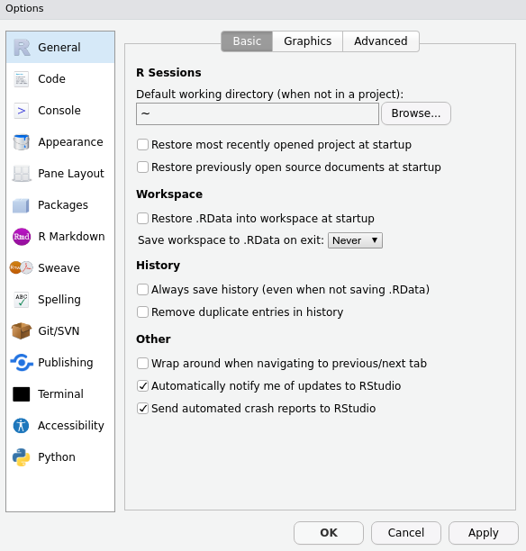
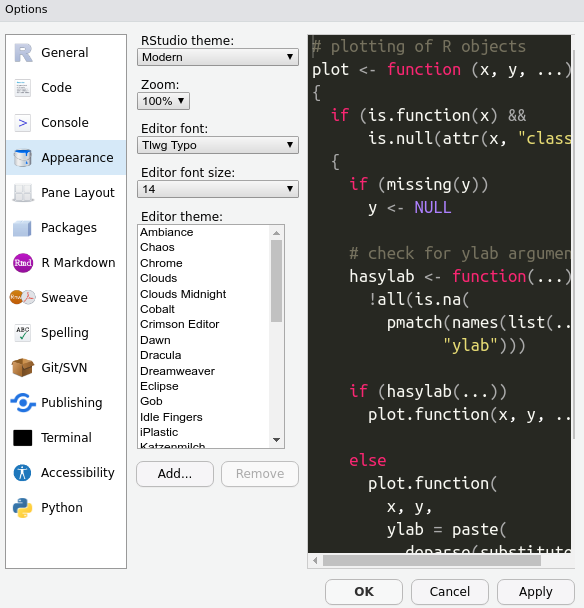

```{r setup, include=FALSE, echo = FALSE}
# Basic knitr options
library(knitr)
opts_chunk$set(comment = NA, 
               echo=FALSE,
               warning = FALSE, 
               message = FALSE, 
               error = TRUE, 
               cache = FALSE,
               fig.width = 9.64,
               fig.height = 5.9,
               fig.path = 'figures/')
options(scipen=999)
```

# Welcome

## What is this website? {.unnumbered}

This is not a textbook or an encyclopedia. This is not a reference manual. It is not exhaustive or comprehensive. We barely mention statistical tests at all. There is almost no theory. In fact, this curriculum is biased, non-representative, and incomplete -- *by design.*

**So what is this?** This website is a *guide* designed to help you through the most dangerous period in your data science education: your very first steps. The first few weeks. That is when 99% percent of people give up on learning to code.

You want to be part of the 1%? Okay, then you need to understand these 3 things:

**Premise 1: We learn best by doing.** Our goal is to get you *doing* data science. We will keep theory and detail to a minimum. We will give you the absolute basics, then offer you exercises and puzzles that motivate you to learn the rest. Then, once you've been *doing* data science for a bit, you soon begin *thinking* like a data scientist. By that, we mean tackling ambiguous problems with persistence, independence, and creative problem solving. With the focus on *doing* (as opposed to listening, reading, watching, etc.), the burden is on *you*. You gotta do the work.

**Premise 2: We learn best with purpose.** Once you gain comfort with the basic skills, you will be able to start working on real data, for real projects, with real impact. You will start to *care about what you are coding*. And that is when the learning curve *skyrockets* -- because you are motivated, and because you are learning *reactively*, instead of preemptively. Our goal is to get you to the point of take-off as quickly as possible.

**Premise 3: A simple toolbox is all you need to build a house.** Once you become comfortable with a few basic coding tools, you can build pretty much anything. The toolbox doesn't need to be that big; if you know how to use your tools well, and if you have enough building supplies (i.e., data), the possibilities are limitless.

**One more thing that this is not:** This is not a fancy interactive tutorial with bells or whistles. We purposefully designed this to be simple and "analog". You will not be typing your code into this website and getting feedback from a robot, or setting up an account to track your progress, or getting pretty merit badges or points when you complete each module.

Instead, you will be doing your work on your *own machine*, working with *real folders and files*, downloading data and moving it around, etc. -- all the things you will be doing as a real data scientist in the real world.

Enough talk. Let's go. Click on "Setting up your computer" and let's get to work.


```{r,include=TRUE,eval=FALSE}
library(dplyr)
library(Hmisc)
library(knitr)
files <- dir()
files <- files[grepl('.Rmd', files)]
files <- files[files != 'index.Rmd']
# # knit them all
# for(i in 1:length(files)){
#   this_file <- files[i]
#   rmarkdown::render(this_file)
# }
files <- gsub('.Rmd', '', files)
files <- Hmisc::capitalize(files)
files <- gsub('_', ' ', files)
files_split <- strsplit(files, split = '-')
chapter_numbers <- unlist(lapply(files_split, function(x){x[1]}))
chapter_names <- unlist(lapply(files_split, function(x){x[2]}))
toc <-
  dplyr::tibble(
    Number = chapter_numbers,
    Name = chapter_names
  )
toc <- toc[which(toc$Number != "Intro"),]
knitr::kable(toc)
```

## Who are we? {.unnumbered}

Datatrain ([www.datatrain.global](https://datatrain.global)) is a project of Databrew ([www.databrew.cc](https://databrew.cc)).

<!--chapter:end:index.Rmd-->

# Setting up your computer

It's time to set up your system. Ready? Let's go.

## Install R {.unnumbered}


First, let's get the right programs installed on your computer. Then we will explain what they are and why you need them.   


**First, download and install `R`: **   

Go to the following website, click the *Download* button, and follow the website's instructions from there.
[https://mirrors.nics.utk.edu/cran/](https://mirrors.nics.utk.edu/cran/){target="blank"}

## Install RStudio {.unnumbered}


**Second, download and install `RStudio`:**    

Go to the following website and choose the free Desktop version:
[https://rstudio.com/products/rstudio/download/](https://rstudio.com/products/rstudio/download/){target="blank"}


**Third, make sure `RStudio` opens successfully:**    

Open the `RStudio` app. A window should appear that looks like this:


**Fourth, make sure `R` is running correctly in the background:**    

In `RStudio`, in the pane on the left (the "Console”), type 2+2 and hit Enter.  
If `R` is working properly, the number “4” will be printed in the next line down.


**Finally, some minor adjustments to make `RStudio` run smoother (and look cooler):**

Go to `Tools > Global Options` and make sure your `General` settings match these exactly:



Specifically, **uncheck** the option under *Workspace* to 'Restore .RData into workspace at startup.'  

Now go to the `Appearance` settings and choose a cool theme!



**Boom!**  You've got R up and running. Now it's time to install some packages.


## Install packages {.unnumbered}

Packages are what makes R so great. To install a package, open Rstudio and type the following code into the "Console" in the bottom left


```{r, eval = FALSE}
install.packages('packagename')
```

Did that work? Probably not, because "packagename" is not a real R package. The packages we'll be using are the following:

```
tidyverse
RColorBrewer
leaflet
ggthemes
rmarkdown
sp
```

To install all of these, you can run `install.packages` for each package:

```{r, eval = FALSE}
install.packages('tidyverse')
install.packages('RColorBrewer')
# etc., etc.
```

So, now you've got R, RStudio, and some cool packages. Good job. You're ready for the next module.


<!--chapter:end:02a-setting-up-your-computer.Rmd-->

# First code

Are you ready to write some code? I hope so, because it's time.

## File paths {.unnumbered}

Good organization is the key to success, so let's start by creating a folder for all of your DataLab work. 

... now that you've done this, **REMEMBER WHERE YOUR FOLDER IS AND STAY ORGANIZED!!** 

## Scripts and your workspace {.unnumbered}

In RStudio, click "File" in the upper left and then "New file -> R Script". This will open a window pane in the upper left of your screen. This "script" is basically a place for you to write and save code. Got it? Good.

Now click "File" then "Save as" and then save your script locally somewhere where you'll remember it. For example, you could save it on your "Desktop" as a file named "firstcode.R".

Your workspace consists of:

- Your script (upper left). This is where you talk to R.  
- The console (bottom left). This is where R talks back to you.  
- The "environment" (upper right). This is a place where you can explore data "objects" you've created (don't worry, we'll get there).  
- The "plots" tab (bottom right). This is where you'll see outputs of charts, maps, etc.  

## R as a calculator {.unnumbered}

At its most basic, R is a big calculator. Or a conversation partner. However you like to think of it. You talk to R by typing some code in your script (upper left), and R talks back by printing something in the console (bottom left).

For example, if you want to ask R what two plus two is, you'd write this on line one of your script.

```{r, eval = FALSE, echo = TRUE}
2 + 2
```

Then, if you place your cursor on that line and run "ctrl + enter" (or "cmd + enter" if on Mac), that code will "run" and R will give you the response.

```{r, eval = TRUE, echo = FALSE}
2 + 2
```

Cool, huh? You can, of course, type more complex math problems. Try typing the following on line 2:

```{r, eval = FALSE, echo = TRUE}
10392 * (13/72)^2 - sqrt(9.123) + (475/2.2)^3
```

Did you get the below as an answer?

```{r, eval = TRUE, echo = FALSE}
10392 * (13/72)^2 - sqrt(9.123) + (475/2.2)^3
```

Good.

As you can see, some calculations are pretty straightforward, like addition (+), subtraction (-), division (/), and even multiplication (*).

```{r, eval = FALSE, echo = TRUE}
4 + 4

4 - 3

12 / 6

10 * 10
```

You can even perform calculations with negative numbers.

```{r, eval = FALSE, echo = TRUE}
96 + -2 
```

And exponents can be denoted like this.

```{r, eval = FALSE, echo = TRUE}
2 ^2

100 ^5
```

Make sure you have run all of these in your computer. Done? Great, that's R as a calculator.

## Re-running code {.unnumbered}

Sometimes you may want to re-run a line of code that you just ran or to recall code so that you can adjust it slightly. Click anywhere in the Console and then press your keyboard's Up arrow. That line of code that appears in your Console is the last line of code you just ran. Good work!

Try clicking the Up arrow three times. Do you see the line of code that you ran three times ago? Yes you do. That's because R keeps a history of everything you have said to it since you opened this window. So if you keep pressing your Up arrow, R will show you all of the lines of code you previously ran. 

If you don't want this old command, simply press Escape to reset the Console's command line, and now you're ready to re-run code in the Console.

## Incomplete commands {.unnumbered}

Similar to talking to a friend, if you start a sentence and don't finish it, your friend will get confused. R gets confused when you enter an incomplete command and will wait for you to finish it in the Console before doing anything.

For example, try running this code in your Console:

```{r, eval = FALSE, echo = TRUE}
45 -
```

Is R giving you a little + sign on the line under your command? That's because it is waiting for you to complete your command.

If you want to complete it, add a number (e.g., 3) and hit Enter. You should now be given an answer (e.g., 42).

Or, if instead you want R to stop waiting and stop running, just press the Escape key

## Getting errors {.unnumbered}

Our commands can't only be complete, but they need to follow the rules of R. We know that if the command is incomplete that R will give us a + sign, but what about when we don't follow the rules of R?

Try running this code in your Console:

```{r, eval = FALSE, echo = TRUE}
4 + y
```

You probably received a message in red font stating: Error: object 'y' not found. That is because R did know how to interpret the symbol y in this case, so it just gave up. 

If R does not understand your code, it will throw an error and give up on trying to execute that line of code but don't be deterred when you see an error! They happen all the time, even to the professionals. The only thing we can do is read your code, find the errors, and fix them.

Here’s another piece of code that will produce an error (just for fun):

```{r, eval = FALSE, echo = TRUE}
dfjkltr9fitwt985ut9e3
```

## Using parentheses {.unnumbered}

Another rule of R pertains to parentheses. Exactly how it is done in math, you can use parentheses to exert control over the order in which you perform calculations. For example, these two commands produce different results:

```{r, eval = FALSE, echo = TRUE}
2*7 - 2*5 / 2

(2*7 - 2*5) / 2
```

__Note__ parentheses need to come in pairs: whenever you type an open parenthesis, (eventually you need to provide a corresponding closed parenthesis).

A very common way to get errors is by missing a parentheses. For instance, the following line of code will return a plus sign (+) since R is waiting for you to close the parenthetical before it processes your command:

```{r, eval = FALSE, echo = TRUE}
4 + (5
```

No matter how many parenthesis you have always close your parenthesis. Based on this which of the below is correct and why? 

```{r, eval = FALSE, echo = TRUE}
(((5+5)))

(((5+5))
```

So lesson is... always close your parentheses even for the funny ones like {...} and [...].

## Use built-in R functions {.unnumbered}

R has some built-in “functions” for common calculations. Rather than defining a function let's just do some.

Let's find the square-root of a number using the ‘squirt’ command, sqrt():

```{r, eval = FALSE, echo = TRUE}
sqrt(16)
```

Note the use of parentheses here. When you are calling a function, when you see parentheses, think of the word ‘of’. This line translates to 'the square root of 16'. You are taking the sqrt of the number inside the parenthetical.

Let's try again with a different function. Find: the log of 4. 

```{r, eval = FALSE, echo = TRUE}
log(4)
```

Note that the function `log()` is the natural log function (i.e., the value that e must be raised to in order to equal 4). To calculate a base-10 logarithm, use `log10( )`.

```{r, eval = FALSE, echo = TRUE}
log(10)

log10(10)
```

Another handy function is round(), for rounding numbers to a specific number of decimal places.

```{r, eval = FALSE, echo = TRUE}
100/3

round(100/3)

round(100/3,digits=1)

round(100/3,digits=2)

round(100/3,digits=3)
```

Finally, R also comes with some built-in values, such as pi:

```{r, eval = FALSE, echo = TRUE}
pi
```

So now that you have used a few functions, let's define it. A function is a package of code that does the following:

* takes a given value, 
* transforms it according to some internal code instructions, 
* and provides an output. 

You will learn more about functions later, but this is a good intro.

## Objects and vectors {.unnumbered}

`R` can do so much more than be just a calculator. Your first step in uncovering the potential of `R` is to make variables.

### All things variables {.unnumbered}

To assign numbers or other types of data to a variable, you use the `<` and `-` characters to make the arrow symbol `<-`. 

```{r, eval = FALSE, echo = TRUE}
x <- 1
y <- 2
```

Where did those values go? You do not see the numbers printed in the _Console_ because the values were stored in the variables x, and y. These are now in the _Environment_. So how do we use or see these variables?

If you want R to tell you what x is, just type the variable name and run it.

```{r, eval = FALSE, echo = TRUE}
x
```

If you want to do calculations with the variables then do it.

```{r, eval = FALSE, echo = TRUE}
x + 100
x * 2
x + y
```

If you want to do calculations with variables and make that answer into a new variable, you can do that too. 

```{r, eval = FALSE, echo = TRUE}
z <- x + y - 1
```

In `R`, a variable is another way to refer to value. That value can be as simple as a single number (e.g., 6) or as complex as a spreadsheet with thousands of rows and columns. Think of a variable as a cup; just as cups make it easy to hold your coffee and carry it from the kitchen to the couch, variables make it easy to contain and work with data.

Let's make a new variable from x that isn't just one value but is multiple values. 

```{r, eval = FALSE, echo = TRUE}
a <- rep(x, 5)
```

How do you look at the response of `a` again? What does it look like the `rep()` function does?

Since `a` isn't just a single value, we can do some cool things, like find how many values are in the variable:

```{r, eval = FALSE, echo = TRUE}
length(a)
```

Let's create a vector, which is very similar to what we did above, and do some calculations:

```{r, eval = FALSE, echo = TRUE}
b <- c(1,2,3)
b + 100
b * 2
```

Good work! You're a master of this. So let's make it interesting. Let's look at some various ages. To start we need to make a new vector and give it a name, however

* A variable/vector name has to have at least one letter in it,
* A variable/vector name has to be connected. AKA no spaces. Instead of a space try a period  ( . ) or an underscore ( _ ). _Note: hyphens cannot be used_,

There are some other rules, but we can learn them as we go so let's jump in and create a variable with some ages and find out some information about these ages.

```{r, eval = FALSE, echo = TRUE}
ages <- c(20, 30, 25, 35)
mean(ages)
max(ages)
min(ages)
median(ages)
summary(ages)
```

Now, in data it is super common to have NAs so let's make a vector called ages but introduce an NA and re-do all those functions. Does it work?

```{r, eval = FALSE, echo = TRUE}
ages <- c(20, 30, 25, 35, NA, 28)
mean(ages)
```

It doesn't work! Well what if we try this:

```{r, eval = FALSE, echo = TRUE}
ages <- c(20, 30, 25, 35, NA, 28)
mean(ages, na.rm = TRUE)
```

Did it work? Of course it did because you're a genius! But more importantly it actually worked because the `na.rm = TRUE` is removing the NA. We are saying "take the mean of ages and remove the NAs." What happens if we set na.rm to FALSE?

```{r, eval = FALSE, echo = TRUE}
mean(ages, na.rm = FALSE)
```

Why didn't this work? This is because we said "take the mean of ages and do not remove the NAs." We can't know the mean of ages when we are missing an age, so we need to remove the unknown in order to be able to do a calculation. Try the na.rm with the calculations we performed above.

```{r, eval = FALSE, echo = TRUE}
max(ages, na.rm = TRUE)
min(ages, na.rm = TRUE)
median(ages, na.rm = TRUE)
summary(ages, na.rm = TRUE)
```

Another interesting feature is that we can do comparisons like greater than and smaller than in R. Let's compare one age with many ages.

```{r, eval = FALSE, echo = TRUE}
old_threshold <- 30
ages > old_threshold
ages < old_threshold
table(ages > old_threshold)
```

This can be very useful right? Let's make an even larger vector and learn some tricks to do so. 

Sometimes it can be hard to type out each individual number hundreds of times so let's take a look below at what are some other ways to look at vectors.

```{r, eval = FALSE, echo = TRUE}
a <- c(1, 2, 3, 4, 5, 6, 7)
b <- 1:1000
d <- seq(0, 1000000, by = 10000)
length(d)
```

Up until this point we have focused on numbers which are numeric, but we can also work with words which we refer to as strings. Let's create a vector with some names of people and call it people and explore the names.

_Note: while you may want to name it names, R already has a function called names, and we want to avoid naming variables and vectors after functions. Just like we don't want to make a variable called mean or min._

```{r, eval = FALSE, echo = TRUE}
people <- c('Michael', 'Nika', 'Delana')
people == 'Matthew'
people == 'Nika'
table(people == 'Nika')
'John' %in% people
'John' == people
```

## Exercises {.unnumbered}

**Use `R` like a calculator**  

**1.** Type a command in the *Console* to determine the sum of 596 and 198.  

**2.** Re-run the sum of 596 and 198 without re-typing it.  

**3.** Recall the command again, but this time adjust the code to find the sum of 596 and 298.  

**4.** Practice escaping an accidentally called command: recall your most recent command, then press the right key to clear the *Console*'s command line.  

&nbsp;  
**Recalling commands**  

**5.** Find the sum of the ages of everyone in your immediate family.  

**6.** Now recall that command and adjust it to determine the *average* age of the members of your family.  

**7.** Find the square root of *pi* and round the answer to the 2 decimal places.

&nbsp;    

**Finding errors**  

**8.** This line of code won't run; instead, `R` will wait for more with a `+` symbol. Find the problem and re-write the code so that it works.  

```{r,echo=TRUE,eval=FALSE,collapse=TRUE}
5 * 6 +
```

**9.** The same goes for this line of code. Fix it, too.  

```{r,echo=TRUE,eval=FALSE,collapse=TRUE}
sqrt(16
```

**10.** This line of code will trigger an error. Find the problem and re-write the code so that it works.

```{r,echo=TRUE,eval=FALSE,collapse=TRUE}
round(100/3,digits+3)
```

**11.** Type a command of your own into R that throws an error, then recall the command and revise so that `R` can understand it.

&nbsp;  


**Show that the following statements are TRUE:**

**12.** `pi` is greater than the square root of 9  

**13.** It is FALSE that the square root of 9 is greater than `pi`  

**14.** `pi` rounded to the nearest whole number equals the square root of 9  

&nbsp;  

**Asking `TRUE` / `FALSE` questions**

**15.** Write and run a line of code that asks whether these two calculations return the same result:

```{r,eval=FALSE,echo=TRUE,collapse=TRUE}
2*7 - 2*5 / 2
```

```{r,echo=TRUE,collapse=TRUE}
(2*7 - 2*5) / 2
```

**16.** Now write and run a line of code that asks whether the first calculation is larger than the second:

&nbsp;

## `R` and `RStudio`: what's the difference? {.unnumbered}

These two entities are similar, but it is important to understand how they are different. 

In short, `R` is an open-source (i.e., free) coding language: a powerful programming engine that can be used to do really cool things with data.

`R Studio`, in contrast, is a free _user interface_ that helps you interact with `R`. If you think of `R` as an engine, then it helps to think of `RStudio` as the car that makes it easier and more comfortable to use the engine to get where you want to go. 

`RStudio` needs `R` in order to function, but `R` can technically be used on its own outside of `RStudio` if you want. However, just as a good car mechanic can get an engine to run without being installed within a car, using `R` on its own is a bit clunky and requires some expertise. For beginners (and everyone else, really), `R` is just so much more pleasant to use when you are operating it from within `RStudio`.

`RStudio` als has increasingly powerful _features_ that make `R` even more useful and versatile in data science. For instance you can make an interactive data dashboard, beautifyl and reproducible data reports, presentations, websites, and even this book! And new features are regularly being added to `RStudio` by its all-star team of data scientists.

That's why we will _always_ use `RStudio´ when working with `R` in this book. 

## Two-minute tour of `RStudio` {.unnumbered}

When you open `RStudio`, you will see a window that looks like the screenshot below:


### Console {.unnumbered}

You are already acquainted with RStudio’s Console, the window pane on the left that you use to “talk” to `R`.

### Environment {.unnumbered}

In the top right pane, the _Environment_, `RStudio` will maintain a list of all the datasets, variables, and functions that you are using as you work. The next modules will explain what variables and functions are.

### Files, Plots, Packages, & Help {.unnumbered}

You will use the bottom right pane very often.

* The **Files** tab lets you see all the files within your **working directory**, which will be explained in the section below.
* The **Plots** tab lets you see the plots you are producing with your code.
* The **Packages** tab lets you see the packages you currently have installed on your computer. Packages are bundles of R functions downloaded from the internet; they will be explained in detail a few modules down the road.
* The **Help** tab is very important! It lets you see documentation (i.e., user’s guides) for the functions you use in your code. Functions will also be explained in detail a few modules down the road.

These three panes are useful, but the most useful window pane of all is actually _missing_ when you first open RStudio. This important pane is where you work with **scripts**.


<!--chapter:end:03a-first-code.Rmd-->

# In-class survey

1. Open a new R script and name it `survey.R`

2. Write code to load the following libraries: `dplyr`, `readr`, and `ggplot2`

```{r, echo = FALSE, eval = TRUE}
library(dplyr)
library(readr)
library(ggplot2)
library(gsheet)
```

3. Fill out the survey at https://docs.google.com/forms/d/e/1FAIpQLSf_-POnYlMPAJO-RJxfbrZef6q9YAEQuPMb3qIBfcmizAkZAw/viewform?usp=sf_link.

4. Once everybody is done, read in the survey by running the below:

```{r, echo = FALSE, eval = TRUE}
if('survey.RData' %in% dir()){
  load('survey.RData')
} else {
survey <- gsheet::gsheet2tbl('https://docs.google.com/spreadsheets/d/1Ra5LhxdCRbmEp-wV07ZlREDt3gysBgyUG4AWuaa1pzk/edit?usp=sharing')
save(survey, file = 'survey.RData')
}
```


```{r, echo = TRUE, eval = FALSE}
survey <- gsheet::gsheet2tbl('https://docs.google.com/spreadsheets/d/1Ra5LhxdCRbmEp-wV07ZlREDt3gysBgyUG4AWuaa1pzk/edit?usp=sharing')
```


5. Run the below code to process the data a bit

```{r, echo = TRUE, eval = TRUE}
names(survey) <- c(
  'timestamp', #  "Timestamp", 
  'name', # "What is your name?", 
  'experience', # "How much experience do you have in R?", 
  'soda', # "How many sodas do you drink a week?", 
  'squat', # "How long do you think you can hold a wall squat (seconds)? (ie, the 'imaginary chair')?", 
  'egypt_or_france', # "Would you rather visit the pyramids of Egypt or the Eiffel tower of Paris?", 
  'bike', # "Do you know how to ride a bike?", 
  'swim', # "Do you know how to swim?", 
  'age', # "How old are you in years?", 
  'where', # "Where do you live?", 
  'lng', # "What is the longitude of your hometown?",
  'lat', # "What is the latitude of your hometown?", 
  'language', # "Do you know how to speak another language aside from English?", 
  'height', # "How tall are you in inches?", 
  'shoe', # "What size shoe do you wear? (US Size)", 
  'hand', # "Are you right-handed or left-handed?", 
  'happy', # "How happy do you consider yourself on a scale from 1 to 5, with 1 being extremely unhappy, 5 being extremely happy, and 3 being the average person?", 
  'sing', # "Do you consider yourself better or worse than average at singing?", 
  'pizza_or_love', # "What's more important pizza or love?", 
  'dance', # "Do you consider yourself better than average at dancing?", 
  'sleep', # "How many hours did you sleep last night", 
  'eat', # "Would you rather eat", 
  'adjective', # "What is the one adjective that best describes you?", 
  'teeth', # "How many teeth do you have?", 
  'braces', # "If you had to have braces the rest of your life, which color would you choose?", 
  'siblings', # "How many siblings do you have?", 
  'wrestle', # "Of the people in this room, who would win a pinky wrestle against Michael?", 
  'hangout', # "What is the best place to hang out in Sewanee?", 
  'movies', # "How many movies have you watched in the last month?"
  'dob' # "What is your date of birth?"
)

```

6. Run the following code to inspect the data

```{r, echo = TRUE, eval = FALSE}
View( survey )
```

## Exploring data {.unnumbered}

7. How many columns are in the data?

8. What are the names of the columns in the data?

9. How many rows are in the data?

10. Write code to look at just the first few rows of the data.

11. Write code to look at just the last few rows of the data.

12. How many people can ride a bike? Cannot ride a bike?

13. How many people can swim? Cannot swim?

14. How many teeth do people have?

15. How happy are people?

## R as a calculator {.unnumbered}

16. What is the average number of teeth per person?

17. What are the minimum and maximum number of teeth per person?

18. What are the average and median heights?

19. What percentage of people can ride a bike? Cannot ride a bike?

20. What percentage of people think that pizza is more important than love?

21. Summarize how much people slept last night.

22. Summarize how many sodas people drink per week.

## `dplyr` {.unnumbered}

Get in groups of two. Create 3 questions to ask of this survey data, each of which involves at least 2 variables. 


<!--chapter:end:04b-in-class-survey-data.Rmd-->

# Exploring a dataset

Let's explore a dataset that consists of people who died and survived during a major event. Maybe you can even guess the event!

1. Open a new R script and name it `survival.R`

2. Write code to load the following libraries: `dplyr`, `readr`, and `ggplot2`

```{r, echo = FALSE, eval = TRUE}
library(dplyr)
library(readr)
library(ggplot2)
```

3. Read in the data by running the following:

```{r, echo = TRUE, eval = TRUE}
people <- readr::read_csv('https://datatrain.cc/data/survival.csv')
```

## `dplyr` {.unnumbered}

4. How many columns are in the data?

5. What are the names of the columns in the data?

6. How many rows are in the data?

7. Write code to look at just the first few rows of the data.

8. Write code to look at just the last few rows of the data.

9. What do you suppose the `survived` variable refers to? 

10. Re-order the dataset by age, from youngest to oldest.

11. How old was the youngest person in the dataset?

12. Re-order the dataset by age, from oldest to youngest.

13. How old was the oldest person in the dataset?

14. How many males are there in the dataset?

15. How many females are there in the dataset?

16. What percentage of the dataset is female?

17. How many people survived?

18. How many people died?

19. What percentage of the people died?

20. How many males survived?

21. How many females died?

22. What percentage of males died?

23. What percentage of people who died were male?

24. What percentage of people who survived were male?

25. What percentage of people who died were female?

26. How many people were in each `class`?

27. How many people from each class survived and died?

28. What percentage of people from each class died?

29. What is the age of the youngest survivor?

30. What is the age of the oldest survivor?

31. What is the age of the youngest surviving male?

32. What is the sex of the oldest person who died?

33. What is the average of age of females who died?

34. What is the average age of males who survived?

35. Make a table showing the exact number of people that died and survived, grouping also by class and sex.

36. Create a variable named `outcome`. Populate this variable with the characters "survived" or "died" depending on the `survived` variable. 

37. Make another variable called `age_group`. If the person is over 18, call them "adult"; otherwise, call them "child".

38. Make another variable called `person_type`. Use `paste0` to combine the `sex` and `age_group` variables, in that order. 

39. Make another variable called `initial`. This should be the first letter of each person's last name. Hint, use `substr`.

40. What is the most prevalent `initial` in the dataset?

41. What is the least prevalent second letter in people's last names?

42. Use `nchar` to calculate the number of letters in each person's name, and make a variable with that value named `name_length`.

43. Who has the longest name in the dataset?

44. Who has the shortest name in the dataset?

45. Make a variable called `above_average_name_length`. This should be `TRUE` if the person's name length is above average, and false if below or at average.

46. Who is more likely to have survived: those with short names, or those with long names.

47. What is the age of the female with the shortest name who survived?

48. What is the sex of the oldest person to have died who had an above average name length?

49. Who, on average, has shorter names: males or females?

50. What is the total number of characters in all female names, and all male names?

## `ggplot2` {.unnumbered}

51. Make a histogram of the age of people.

52. Make a barchart of the class of people.

53. Make a barchart of the `outcome` variable.

54. Make a scatterplot of the `name_length` and `age` variables.

55. Make a chart showing the age of males and females separately.

56. Make a chart showing survivorship by sex.

57. Make a chart showing survivorship by age.

58. Make a chart showing the age, sex, and survivor status of people.

59. Make a chart showing the distribution of the lengh of people's names.

60. Assume that the average life expectancy is 80. How many years of life were lost due to this event?

61. How many years of life lost were attributible to males? How many to females?

62. Make three more charts.

63. What caused this event?

<!--chapter:end:04c-exploring-a-dataset.Rmd-->

# Visualizing data with `ggplot2`  

## Introduction to ggplot2 {.unnumbered}

Tables and summary statistics are fine, but a good visualization is even better! This is where the `tidyverse` shines, so it's time to learn how to use its fantastic visualization package, `ggplot2`.

**1.** Open a new R script and name it `ggplot.R`.

**2.** Write code to load the `tidyverse`.

**3.** Load our survey data and clean things up a bit:

```{r, echo=TRUE, message=FALSE, eval = FALSE}

survey <- gsheet::gsheet2tbl('https://docs.google.com/spreadsheets/d/1Ra5LhxdCRbmEp-wV07ZlREDt3gysBgyUG4AWuaa1pzk/edit?usp=sharing')

names(survey) <- c(
  'timestamp', #  "Timestamp", 
  'name', # "What is your name?", 
  'experience', # "How much experience do you have in R?", 
  'soda', # "How many sodas do you drink a week?", 
  'squat', # "How long do you think you can hold a wall squat (seconds)? (ie, the 'imaginary chair')?", 
  'egypt_or_france', # "Would you rather visit the pyramids of Egypt or the Eiffel tower of Paris?", 
  'bike', # "Do you know how to ride a bike?", 
  'swim', # "Do you know how to swim?", 
  'age', # "How old are you in years?", 
  'where', # "Where do you live?", 
  'lng', # "What is the longitude of your hometown?",
  'lat', # "What is the latitude of your hometown?", 
  'language', # "Do you know how to speak another language aside from English?", 
  'height', # "How tall are you in inches?", 
  'shoe', # "What size shoe do you wear? (US Size)", 
  'hand', # "Are you right-handed or left-handed?", 
  'happy', # "How happy do you consider yourself on a scale from 1 to 5, with 1 being extremely unhappy, 5 being extremely happy, and 3 being the average person?", 
  'sing', # "Do you consider yourself better or worse than average at singing?", 
  'pizza_or_love', # "What's more important pizza or love?", 
  'dance', # "Do you consider yourself better than average at dancing?", 
  'sleep', # "How many hours did you sleep last night", 
  'eat', # "Would you rather eat", 
  'adjective', # "What is the one adjective that best describes you?", 
  'teeth', # "How many teeth do you have?", 
  'braces', # "If you had to have braces the rest of your life, which color would you choose?", 
  'siblings', # "How many siblings do you have?", 
  'wrestle', # "Of the people in this room, who would win a pinky wrestle against Michael?", 
  'hangout', # "What is the best place to hang out in Sewanee?", 
  'movies', # "How many movies have you watched in the last month?"
  'dob' # "What is your date of birth?"
)

survey <- survey %>% 
  mutate( dob = mdy( dob ),
          age_in_weeks = as.numeric( difftime( Sys.Date(), dob, units = 'weeks') ) ) 

```

**4.** In order to make a plot we need a piece of paper or a canvas. So let's make a canvas:


**5.** To get started, let's make some bar plots.


**6.** Great! Now let's make a different kind of plot. First, draw your x axis and your y axis _(a.k.a. make your coordinates)_. Ask yourself: ***What do I want to see?***


**7.** Map the data to the coordinates. Here we will map the data to the coordinates using points. Ask yourself: ***How do I want to show what I want to see?***


**8.** What if you want to color code these points? Now you're choosing what else you want to see and how.


**9.** Add some labels. `ggplot()` automatically added axis titles and a legend, but we can add some more using the `labs()` function. Let’s add an overhead title, a sub-title, and a caption.


**10.** We can also make separate plots for a variable by faceting.


**11.** Let's stylize the plot with a different theme.


**12.** 
Ready for something different? Let's make a histogram.

**13.**
As you can see, we can make a lot of different types of charts in R. You can even make a new variable and use it in your plot, but let's not get ahead of ourselves. So let's learn by doing rather than lecturing and move on to a new dataset.

***

## Demography exercises {.unnumbered}

We're going to work with some anonymized demography data, for both households and individuals. Let's start by creating a new script, naming it `demography.R`, and reading in some data as shown below:

```{r,echo=TRUE,collapse=TRUE,message=FALSE,warning=FALSE,eval=FALSE}
library(tidyverse)
households <- readr::read_csv('https://datatrain.cc/data/anonymized_demography.csv')
people <- readr::read_csv('https://datatrain.cc/data/anonymized_demography_individuals.csv')
```

1. What is the average age of people?

2. On average, who is older: men or women?

3. How many children are there in the dataset?

4. Make a histogram of age.

5. Make a smoothed histogram using `geom_density` of age.

6. Make a smoothed histogram of age, but make different "fill" colors for men and women.

7. Make a point chart wherein the x-axis is sex and the y-axis is age.

8. Replace `geom_point` with `geom_jitter` so that the points don't overlap so much.

9. Make the points semi-transparent.

10. Make the points twice as large.

11. Give the plot a title, an x label, and a y label.

12. Add a "violin" plot to the plot.

13. Move the violin to _behind_ the points.

14. Make the points colored by sex.

15. Replace the violin chart with a boxplot.

16. What is the breakdown of household heads and sex (i.e., what number and percentage of household heads are male vs female)?

17. Make a bar chart showing the number of households which are headed by men vs women.

18. What is the average age of household heads who are female vs. the average age of household heads who are male?

19. Make a chart showing the distribution of household heads' age, which shows both males and females separately.

20. What do you think explains this difference in age?

21. Make a new variable indicating whether the household head is the oldest person in their household or not.

22. What percentage of female household heads are the oldest person in their household? And males?

23. What is the age of the youngest household head?

24. Create a simple scatter plot with longitude as the x value and latitude as the y value.

25. Make a table showing the distribution of wall types.

26. Make a chart to replace the above table.

27. Which fieldworker visited the most households?

28. Which cluster has the most cattle?

29. On what date were most households visited?

## Gapminder exercises {.unnumbered}

This review exercise is useful immediately after you learn `ggplot2` and `dplyr`.  

&nbsp;  

First, let's read in some data on health from the World Bank:

```{r,echo=TRUE,collapse=TRUE,message=FALSE,warning=FALSE}
library(readr)
library(dplyr)
library(ggplot2)
library(gapminder)
gm <- gapminder::gapminder
```

**1.** How many rows are in the dataset?

**2.** How many columns are in the dataset?

**3.** What are the names of the columns?

**4.** What is the oldest year in the dataset?

**5.** What is the country/year with the greatest population in the dataset?

**6.** Get the average GDP per capita for each continent  in 1952.

**7.** Get the average GDP per capita for each continent for the most recent year in the dataset.

**8.** Average GDP is a bit misleading, since it does not take into account the relative size (in population) of the different countries (ie, China is a lot bigger than Cambodia). Look up the function `weighted.mean`. Use it to get the average life expectancy by continent for the most recent year in the dataset, weighted by population.

&nbsp; 

**9.** Make a barplot of the above table (ie, average life expectancy by continent, weighted by population).

**10.** Make a point plot in which the x-axis is country, and the y-axis is GDP. Add the line `theme(axis.text.x = element_text(angle = 90))` in order to make the x-axis text vertically aligned. What's the problem with this plot? How many points are there per country?

**11.** Make a new version of the above, but filter down to just the earliest year in the dataset.

**12.** Make a scatterplot of life expectancy and GDP per capita, just for 1972.

**13.** Make the same plot as above, but for the most recent year in the data.

**14.** Make the same plot as the above, but have the size of the points reflect the population.

**15.** Make the same plot as the above, but have the color of the points reflect the continent.

&nbsp; 

**16.** Filter the data down to just the most recent year in the data, and make a histogram (`geom_histogram`) showing the distribution of GDP per capita.

**17.** Get the average GDP per capita for each continent/year, weighted by the population of each country. 

**18.** Using the data created above, make a plot in which the x-axis is year, the y-axis is (weighted) average GDP per capita, and the color of the lines reflects the content.

**19.** Make the same plot as the above, but facet the plot by continent.

**20.** Make the same plot as the above, but remove the coloring by continent.

&nbsp; 

**21.** Make a plot showing France's population over time.

**22.** Make a plot showing all European countries' population over time, with color reflecting the name of the country.

**23.** Create a variable called `status`. If GDP per capita is over 20,000, this should be "rich"; if between 5,000 and 20,000, this should be "middle"; if this is less than 5,000, this should be "poor".

**24.** Create an object with the number of rich countries per year.

**25.** Create an object with the percentage of countries that were rich each year.

&nbsp; 

**26.** Create a plot showing the percentage of countries which were rich each year.

**27.** Create an object with the number of people living in poor countries each year.

**28.** Create a chart showing the number of people living in rich, medium, and poor countries per year (line chart, coloring by `status`).

**29.** Create a chart showing the life expectancy in Somalia over time.

**30.** Create a chart showing GDP per capita in Somalia over time.

&nbsp; 

**31.** Create a histogram of life expectancy for the most recent year in the data. Facet this chart by continent.

**32.** Create a barchart showing average continent-level GDP over time, weighted for population, with one bar for each year, stacked bars with the color of the bars indicating continent (`geom_bar(position = 'stack')`).

**33.** Create the same chart as above, but with bars side-by-side (`geom_bar(position = 'dodge')`)

**34.** Generate 3-5 more charts / tables that show interesting things about the data.

**35.** Make the above charts as aesthetically pleasing as possible.

## Exercises with world health data {.unnumbered}

Start by reading in your data.

```{r}
library(dplyr)
library(readr)
df <- read_csv('https://raw.githubusercontent.com/databrew/intro-to-data-science/main/data/hefpi.csv')
```

1. Explore the data, and write 3 questions you'd like to ask it.

2. Answer the questions with tables.

3. Answer the questions with charts.

<!--chapter:end:04d-visualizing-data-with-ggplot.Rmd-->

# Exploring sanitation 

In the world of data science and public health, we have to work as a team to solve problems. Today you are going to apply what you've learned about `dplyr` and `ggplot` to learn about sanitation around the world. Good luck!

**1.** Make a folder in your datalab folder on your desktop and call it `sanitation`.

**2.** Open up an RScript and name it `sanitation.R` and save it into your `sanitation` folder.

**3.** In your RScript copy the following questions 4-7 and answer them as a team.

**4.** Look up improved vs. unimproved sanitation. What kind of sanitation does the US use, improved, unimproved or both?

**5.** What is open defecation?  Is it a type of improved or unimproved sanitation?

**6.** Is open defecation bad or good? Why or why not?

**7.** Why do some countries have high rates of open defecation and others do not?

**8.** Now that you know a bit about sanitation, let's start looking at some data. Download the dataset shared with you on slack (`sanitation.csv`) and save it to your `sanitation` folder.

**9.** **STOP! WE WILL DO THIS TOGETHER!** In your `sanitation.R` script underneath your questions, copy and paste the following line of code and inside the quotes hit tab. Then follow your files until you are in your `sanitation` folder which is inside your datalab folder on your desktop. If it is not there, go back and re-do questions 1 and 2 above (don't forget to comment your script!):

```{r, echo=TRUE, message=FALSE, eval = FALSE}
# set working directory
setwd("")
```

**10.** Write code to load the `tidyverse`.

**11.** Now load `sanitation.csv` into R and assign it a name using the following line of code:

```{r, echo=TRUE, message=FALSE, eval = FALSE}
# load in the data
sanitation <- read_csv('sanitation.csv')
```

**12.** What are the column names and based on these column names what is this dataset about? 

**13.** Make a table of the World Bank's income classifications.

**STOP! WE WILL DO THE NEXT FEW QUESTIONS TOGETHER!**

**14.** Since working with really long column names with spaces is really hard, let's change the column names together.

**15.** Let's look at data for the most recent year. 

**16.** To make it easier to explore the most recent data, let's name this dataset `latest`. 

**17.** Using `latest`, how many countries are there? 

**18.** How many countries are there from each continent?

**19.** How many countries are there from each income group?

**20.** Let's look at data for the low-income countries in Asia. How have their open defecation rates changed over time? **Let's talk through this together before writing any code!**

**RESUME WORKING WITH YOUR GROUP NOW!**

**21.** Make a line graph of safely managed sanitation services over the years in India.

**22.** Make a line graph of open defecation rates over the years for the country of your choice.

**23.** Using `latest`, make a scatterplot showing GDP per capita versus open defecation rates. Color the points by income group and give your plot good labels.

**24.** Now create separate panels showing the same scatterplots by continent.

**25.** To make these scatterplots nicer, let's move the legends and reorder the income groups. We'll do this one together!

**26.** To learn another new thing, let's make a bar chart of sanitation services for South America. Then improve it by filling by income group.

**27.** Now make a bar chart of sanitation services for the continent of your choice. Remember to fill by income group!

**28.** Using `latest`, make a scatterplot showing rural versus urban open defecation rates. Color the points in an informative way and give your plot good labels.

**29.** Put the sanitation data for the first year in `sanitation` in an object called `oldest`.

**30.** Recreate the visuals above using `oldest` and compare the results to what you got with `latest`. What's changed? What hasn't changed?


<!--chapter:end:04e-exploring-sanitation.Rmd-->

# Making maps

Maps are great for exploring geographic data, like the prevalences of diseases in different countries or the
demographics of voting districts in different states. In addition to being efficient data visualizations, 
well-made maps are beautiful!

**1.** Open a new R script and name it `maps.R`

**2.** Install the following libraries: `sf`, `rnaturalearth`, `rnaturalearthhires`, `rnaturalearthdata`, `tmap`, `osmdata`, and `tidycensus`

**3.** Now that you've installed these libraries, write code to load them along with `dplyr`.

```{r, echo = FALSE, eval = FALSE}
library(dplyr)
library(sf)
library(rnaturalearth)
library(rnaturalearthhires)
library(rnaturalearthdata)
library(tmap)
library(osmdata)
library(tidycensus)
```

**4.** The first thing you have to do to make a map is to get the underlying geospatial data -- we'll use the `rnaturalearth` packages to streamline this step, which can sometimes be quite challenging! Since you met people from KEMRI this morning, let's start by getting the data we need for a map of Kenya:

```{r, echo=TRUE, eval=FALSE}

kenya <- ne_countries( country = "Kenya", returnclass = "sf" )

```

**5.** Look at the data in the `kenya` object to get a feel for what's there. How many columns are there? What are their names?

**6.** For right now, the most important column is the one called `geometry`. Let's look at it:

```{r, echo=TRUE, eval=FALSE}

kenya$geometry

```

**7.** This tells us what kind of geospatial data we've got: a polygon. This also tells us how to make our map!

```{r, echo=TRUE, eval=FALSE}

tm_shape( kenya ) + 
  tm_polygons()

```

**8.** Great! That's Kenya. Not a very exciting map, though -- let's make it better and more interactive:

```{r, echo=TRUE, eval=FALSE}

# get a good background :
tmap_options( basemaps = providers$OpenStreetMap ) 

# make the map interactive :
tmap_mode( "view" )

# make a map of Kenya with a nice transparency setting :
tm_shape( kenya ) + 
  tm_polygons( alpha = 0.5 )

```

**9.** Time to try something new: with your partner, get the data you need and make a map of Mozambique.

**10.** Countries are not just monoliths -- they have constituent states or districts. Let's get a more detailed map of Kenya:

```{r, echo=TRUE, eval=FALSE}

kenya_states <- ne_states( country = "Kenya", returnclass = "sf" )

tm_shape( kenya_states ) + 
  tm_polygons( alpha = 0.5 )

```

**11.** Wouldn't it be nice if we could see the names of the states easily? Great idea! 

```{r, echo=TRUE, eval=FALSE}

tm_shape( kenya_states ) + 
  tm_polygons( alpha = 0.5, id = "name" )

```

**12.** Update your map of Mozambique to show its districts with their names.

**13.** What if you want to make a map of all of Africa? That's easy, too, once you have the right geospatial data. Let's start big:

```{r, echo=TRUE, eval=FALSE}

world <- ne_countries( scale = "medium", returnclass = "sf" )

tm_shape( world ) + 
  tm_polygons( alpha = 0.5 )

```

**14.** Explore the names of the columns in `world`. How can we get the countries in Africa? Use your `dplyr` skills!

```{r, echo=FALSE, eval=FALSE}

tm_shape( world %>% filter( continent == "Africa") ) + 
  tm_polygons( alpha = 0.5, id = "name" )

```

**15.** Make a map of South America, with country names shown when you mouse over them.

**16.** Now for a challenge: let's make a map of South America showing all of the countries' constituent states/districts.

## Exploring features with `osmdata` {.unnumbered}

## Exploring census tracts with `tidycensus` {.unnumbered}

<!--chapter:end:04f-making-maps.Rmd-->

# Making choropleths

Now that you know how to make some basic maps, let's learn how to add information to them. Open a new R script, name it `choropleths.R`, and save it to your DataLab folder.

**1.** At the top of `choropleths.R`, load the libraries we used to make our first maps. Also, load the library `readr` so we can read CSVs as needed.

```{r, echo = TRUE, eval = FALSE}
library(dplyr)
library(readr)
library(sf)
library(rnaturalearth)
library(rnaturalearthhires)
library(rnaturalearthdata)
library(tmap)
```

**2.** For starters, let's use data from the `spData` package to make a U.S. map. First, get the data:

```{r, echo=TRUE, eval=FALSE}
us_states <- spData::us_states
```

**3.** Use `tmap` to make a map with this data. 

```{r echo=FALSE, eval=FALSE}
tm_shape( us_states ) + tm_polygons()
```

**4.** Explore the data a bit -- what other information could we show on our map? Let's do it!

```{r echo=FALSE, eval=FALSE}

# note the typo in one of the regions -- fix it and then redraw the map!
tm_shape( us_states ) + tm_polygons( col = "REGION")

# other options:
tm_shape( us_states ) + tm_polygons( col = "AREA")
tm_shape( us_states ) + tm_polygons( col = "total_pop_15")

```

***

Maps like these, with regions colored according to some data, are called _choropleths_. Making one usually involves three steps: 

- get the geospatial dataset you need,
- get the dataset with the other data you want to show, and
- add the other data to the geospatial dataset. 

We'll go through these steps together once, then you and your partner will go through them with some new data to make your own choropleth.

**5.** Create an object called `world` that has polygons for all of the world's countries. (Review what we did before!)

```{r echo=FALSE, eval=FALSE}
world <- ne_countries( scale = "medium", returnclass = "sf" )
```

**6.** Remove Antarctica from `world` -- this will make our map look nicer later.

```{r echo=FALSE, eval=FALSE}
world <- world %>% filter( name != "Antarctica")
```

**7.** Make a map of the world (excluding Antarctica).

**8.** Using the `pop_est` variable in `world`, update your world map and color the countries according to their populations. If the legend is in the way, move it!

**9.** Download data on [outdoor air pollution from Our World in Data](https://ourworldindata.org/outdoor-air-pollution). Save the data in the file `pollution.csv` in your DataLab folder.

**10.** Use `readr::read_csv()` to load your pollution data.


**11.** Use the `dplyr` function `rename()` to rename ONLY the last column in `pollution`. Let's make the new name "share_of_deaths".

```{r echo=FALSE, eval=FALSE}
pollution <- pollution %>% rename( share_of_deaths = `Share of total deaths that are from all causes attributed to ambient particulate matter pollution, in both sexes aged age-standardized`)
```

**12.** Compare the variables in `pollution` with the variables in `world` to figure out how to join them. We'll go through this together.

```{r echo=FALSE, eval=FALSE}
world <- left_join( world, pollution %>% filter( Year == 2019 ) %>% rename( iso_a3_eh = Code, ), by = "iso_a3_eh")
```

**13.** Make a new world map and color the countries according to their share of deaths attributed to pollution.

```{r echo=FALSE, eval=FALSE}
tm_shape( world ) + tm_polygons( col = "share_of_deaths", title = "Share of deaths due to pollution", id = "name" ) + tm_layout( legend.position = c("left", "bottom") )
```


<!--chapter:end:04g-making-choropleths.Rmd-->

# Working with dates and times 

_"Today is a day. Tomorrow is another day. And right now is a moment in time that has changed to another moment in time, from one second to the next."_ - Anonymous

### Learning goals {.unnumbered}
* Be able to read dates, and convert objects to dates  
* Be able to convert dates, extract useful information, and modify them  
* Use date times  
* Gain familiarity with the lubridate package 


Hadley Wickham’s [tutorial on dates](https://r4ds.had.co.nz/dates-and-times.html) starts with 3 simple questions and some useful observations:

> * Does every year have 365 days?  
> * Does every day have 24 hours?  
> * Does every minute have 60 seconds? 
>
> I’m sure you know that not every year has 365 days, but do you know the full rule for determining if a year is a leap year? (It has three parts.) You might have remembered that many parts of the world use daylight savings time (DST), so that some days have 23 hours, and others have 25. You might not have known that some minutes have 61 seconds because every now and then leap seconds are added because the Earth’s rotation is gradually slowing down.
> 
> Dates and times are hard because they have to reconcile two physical phenomena (the rotation of the Earth and its orbit around the sun) with a whole raft of geopolitical phenomena including months, time zones, and DST. This chapter won’t teach you every last detail about dates and times, but it will give you a solid grounding of practical skills that will help you with common data analysis challenges.

## Getting to work {.unnumbered}

First, open an RScript, name it `dates and times.R` and set your working directory.

Install the lubridate package and load the library.

```{r, echo = TRUE, eval = FALSE}
install.packages('lubridate')
```

```{r, echo = TRUE, eval = FALSE}
library(lubridate)
library(dplyr)
```

## Getting familar with `dates` {.unnumbered}

Get today's date using: 

```{r, echo = TRUE, eval = FALSE}
today()
```

Then make today into an object called today.

Even though `today` looks like a simple character string, it is not. There are all sorts of date-time calculations in the background. 

To demonstrate this, let's bring in a simple string. Make variables called `my_bday` and `my_partners_bday` using the following format (but adjust to match your actual birthdays!):

```{r, echo = TRUE, eval = FALSE}
my_birthday <- '2003-06-09'
my_partners_bday <- '2004-02-18'
```

If you run `str(my_birthday)` and `str(today)`, do you see any major differences? (talk amongst your group)

Note that class type of the variable impacts what you can do with the text. For instance, the following causes an error...

```{r, echo = TRUE, eval = FALSE}
today - my_birthday
```

Try re-running the calculation above after running the following line of code:

```{r, echo = TRUE, eval = FALSE}
my_birthday <- as_date(my_birthday)
```

Why did it work?

Now convert `my_partners_bday` to the right class, then calculate the time between your birthdays. 

## The `datetime` class {.unnumbered}

When you are working with a `datetime` object, you can add and subtract time to it. 

Let's make a variable that has the time as of right now and then look at it:

```{r, echo = TRUE, eval = FALSE}
n <- now()
n
```

This is how you can add or subtract seconds to now:

```{r, echo = TRUE, eval = FALSE}
n + seconds(1)
```

Add or subtract hours:

```{r, echo = TRUE, eval = FALSE}
n - hours(5)
```

Want to only see the date of now? Try this:

```{r, echo = TRUE, eval = FALSE}
as_date(n)
```

Look at how time flies when you're having fun:

```{r, echo = TRUE, eval = FALSE}
later <- now()
later
```

Calculate how long it took you from when you created `now` until you created the variable `later`.

## Common tasks {.unnumbered}

### Converting words (strings) to dates {.unnumbered}

The `lubridate` package was built to handle dates of various input formats. The following functions convert a character with a particular format into a standard `datetime` object:

```{r, echo = TRUE, eval = FALSE}
ymd("2017-01-31")
```

This also works if the single-digit dates are not padded with a 0:

```{r, echo = TRUE, eval = FALSE}
ymd("2017-1-31")
```

Other formats can also be handled. Try to find a way to make the following into date formats:

```{r, echo = TRUE, eval = FALSE}
"2017-31-01"

"January 31st, 2017"

"31-Jan-2017"
```

_Hint_: try re-organising the letters from `ymd` which stands for "year month day".

### Extracting components from dates {.unnumbered}

Let's practice extracting information from the following `datetime` object:

```{r, echo = TRUE, eval = FALSE}
datetime <- ymd_hms("2016-07-08 12:34:56")
year(datetime)
```

Get the month:

```{r, echo = TRUE, eval = FALSE}
month(datetime)
```

Get the day of the month:

```{r, echo = TRUE, eval = FALSE}
mday(datetime)
```

Get the day of the year:

```{r, echo = TRUE, eval = FALSE}
yday(datetime)
```

Get the day of the week:

```{r, echo = TRUE, eval = FALSE}
wday(datetime)
```

Get the name of the day of the week:

```{r, echo = TRUE, eval = FALSE}
weekdays(datetime)
```

Get the hour of the day:

```{r, echo = TRUE, eval = FALSE}
hour(datetime)
```

Get the minute of the hour:

```{r, echo = TRUE, eval = FALSE}
minute(datetime)
```

Get the seconds of the minute:

```{r, echo = TRUE, eval = FALSE}
second(datetime)
```

### Dealing with time zones {.unnumbered}

When working with dates and times in `R`, time zones can be a major pain, but the `lubridate` package tries to simplify this.

Adjust timezones for dates:

```{r, echo = TRUE, eval = FALSE}
# Today's date where I am
today()

# Today's date in New Zealand
today( tzone = 'NZ' )
```

Adjust time zones for date-times:

```{r, echo = TRUE, eval = FALSE}
# Time where I am
now()

# Time in UTC / GMT (which are synonymous)
now('UTC')

now('GMT')
```

Don't know what time zone your computer is working in? Use this function:

```{r, echo = TRUE, eval = FALSE}
Sys.timezone()
```

To get a list of time zones accepted in `R`, use the function `OlsonNames` (there are about 500 options):

```{r, echo = TRUE, eval = FALSE}
OlsonNames() %>% head(50)
```

If you ever need to force the timezone of a `datetime` object to change without actually changing the date or time, use the function `force_tz()`:

```{r, echo = TRUE, eval = FALSE}
# Get current time in UTC/GMT
n <- now('UTC')
n

# Change timezone to Central Standard Time without changing time:
force_tz(n, tzone='America/Chicago')
```

### Using timestamps instead {.unnumbered}

One way to avoid timezone issues is to convert a `datetime` object to a numeric timestamp.

Timestamps record the number of seconds that have passed since midnight GMT on January 1, 1970. It doesn't matter which timezone you are standing in the seconds that have passed since that moment will be the same:

```{r, echo = TRUE, eval = FALSE}
# Time where I am
now() %>% as.numeric()
```

What is the difference between the line of code above and `now()`?

Timestamps can simplify things when you are doing a lot of adding and subtracting with time. Timestamps are just seconds; they are just numbers. So they are much less of a black box than `datetime`objects.

You can always convert from a timestamp back into a `datetime`object:

```{r, echo = TRUE, eval = FALSE}
# Convert to timestamp
ts <- now() %>% as.numeric()
ts

# Convert back to datetime object
ts %>%  as_datetime()
```

### Exercises {.unnumbered}

__Create `datetime` objects__

Use the appropriate `lubridate` function to parse each of the following dates (_aka make each of the following strings into dates_):

**1.** `January 1, 2010`

**2.** `2015-Mar-07`

**3.** `06-Jun-2017`

**4.** `c('August 19 (2015)', 'July 1 (2015)')`

**5.** `12/30/14` 

__Extracting `datetime` components__

Work with this date:

```{r, echo = TRUE, eval = FALSE}
dt <- '2000-01-04 03:43:01'
```

**6.** Make a variable with the following name with the corresponding information using the date above:

* `raw` (containing the original string)
* `year`
* `month`
* `dom`(day of month)
* `doy` (day of year)
* `hour`  
* `minutes`  
* `seconds` 

**7.** Now calculate two more variables:

* `timestamp`  
* `diff`(the difference, in days, between this time and midnight GMT on January 1, 1970)

__Some common uses of `datetime`__

**8.** Write code to say what time it is in the timezone that you were born in.

**9.** Calculate your age using your birthday and today's date in years. In days! In seconds!!

**10.** How many seconds have occurred since the Armistice Day?

## Dates, Times, and Malaria {.unnumbered}

### Learning goals {.unnumbered}

* This is a review exercise. You'll be using the skills you've developed with the ´dplyr´, ´ggplot2´, and `lubridate` packages.

**1.** Start a new script. Name it `malaria.R`. 

**2.** Set up your work space by loading the `readr`, `ggplot2`, `dplyr`, and `lubridate` packages.

**3.** Read in some malaria data by running the following:

```{r, echo = TRUE, eval = FALSE}
pms <- read_csv('https://github.com/databrew/intro-to-data-science/blob/main/data/pms.csv?raw=true')
```

**4.** Take a look at the first few rows of the data. What is the unit of observation?

**5.** Create a new column/variable in pms named dow (as in, “day of week”). This should be the day of the week of the date_visit.

**6.** How many visits were there to Catale on May 1 2022?

**7.** How many of those were for malaria?

**8.** Which age group has had the most malaria?

**9.** What day of the week has the most visits?

**10.** Which month has had the most malaria visits?

**11.** Which month has had the greatest percentage malaria visits?

**12.** Make a variable called hour of day?

**13.** Which hour of day has the most visits?

**14.** What do you think the function mdy_hms is/does?

**15.** Look up the documentation for mdy_hms.

**16.** Use mdy_hms to create a new variable in pms named date_time based on the variable start_time.

**17.** Use the hour function to create a variable named hour_of_day from the date_time variable. This should be the hour of the day.

**18.** Get the total number of malaria cases diagnoses by hour of day.

**19.** Visualize the total number of malaria cases diagnoses by hour of day.

**20.** Visualize the total number of malaria cases diagnoses by hour of day, but separated by day.

## Coughs {.unnumbered}

As you can see there are SO many ways you can work with dates and times. One final example which you may not have thought of is... _coughs_!

First, download some data:

```{r, echo = TRUE, eval = FALSE}
coughs <- read_csv('https://raw.githubusercontent.com/databrew/intro-to-data-science/main/data/coughs.csv')
```

**1.** Create a `dow` (day of week) column.

**2.** Create a `date` (without time) column.

**3.** How many coughs happened each day?

**4.** Create a chart of coughs by day.

**5.** Look up the function `floor_date`. Use it to get the number of coughs by date-hour.

**6.** Create an `hour` variable.

**7.** Use the `hour` variable to create a `night_day` column indicating whether the cough was occurring at night or day.

**8.** Does this child cough more at night or day?

Once you're done be sure to ask Matthew, 'what is [Hyfe](https://www.hyfe.ai/)?'


<!--chapter:end:04h-dates-and-times.Rmd-->

# Working with text

### Learning goal {.unnumbered}

Time to learn how to apply the most common R tools for working with text: strings, words, sentences, and so on!
 
If you don't learn how to edit and transform text-based fields within datasets, you'll quickly get stuck in `R`. Think of dates, GPS coordinates, user IDs, group names, plot labels, etc. All of these forms of data can contain non-numeric text. Becoming comfortable working with text in `R` is an absolutely essential part of your `R` toolkit.

Here we will present the most common functions for working with text. Remember that R has a special object class for text, known as the **character** class, and that character objects are often referred to as **strings**.

Most of these functions come pre-installed in R. However, several of the tools we will show here (as well as many other useful tools that we will not detail here) come from the `stringr` package. Go ahead and install `stringr` and load it using `library()`.

```{r, echo = TRUE, eval = FALSE}
install.packages("stringr")
library(stringr)
```

## Most common tools {.unnumbered}

**`paste()` & `paste0()`**
`paste()` and `paste0()` combine two or more strings together into a single object:

```{r, echo = TRUE, eval = FALSE}
i <- 10
n <- 96
file_name <- "this_file.csv"

paste(i,"of",n,": Processing",file_name,". . . ")
```

Notice that `paste()` separates terms with a blank space; you'll see in a moment that `paste0()` does _not_ separate terms. 
Here’s the same input but with `paste0()` instead:

```{r, echo = TRUE, eval = FALSE}
paste0(i,"of",n,": Processing",file_name,". . . ")  
```

To replicate the original output with `paste()`, you manually add blank spaces like this:

```{r, echo = TRUE, eval = FALSE}
paste0(i," of ",n,": Processing ",file_name," . . . ")   
```

You can also use `paste()` to collapse multiple objects into a single string.

```{r, echo = TRUE, eval = FALSE}
x <- 1:10
paste(x,collapse=";") 
```

Make an object called `ages` that has the ages of everyone in your group, then use `paste` and `collapse` to list these ages.

**`tolower()` & `toupper()`**
`tolower()` and `toupper()` force all text in a string to lower case or upper case, respectively. Run the following:

```{r, echo = TRUE, eval = FALSE}
x <- "That Tree Is Far Away."
tolower(x)
toupper(x)
```

What happens if you change x to `"That Tree Is 5 Meters Away."` Does it still work?

**`nchar()`**
`nchar()` returns the number of characters within a string. How many characters are in x?

```{r, echo = TRUE, eval = FALSE}
nchar(x)
```

**`substr()`**
`substr()` trims a string according to a start and end character position. Run the following:

```{r, echo = TRUE, eval = FALSE}
dates <- c("2021-03-01",
           "2021-03-02",
           "2021-03-03")
substr(dates,1,4) # years
substr(dates,6,7) # months
substr(dates,9,10) # days
```

What do the numbers in `substr` correspond to in the `dates` list?

**`grep()`**
`grep()` returns the elements in a character vector that contain a given pattern. Run the following:

```{r, echo = TRUE, eval = FALSE}
years <- 1900:1999

# Which elements correspond to the 1980s?
eighties <- grep("198",years)
eighties

years[eighties]
```

**`grepl()`**
`grepl()` tells you which elements in a character vector contain a given pattern. Run the following:

```{r, echo = TRUE, eval = FALSE}
some_names <- c("Bob", "Boba Fett", "Leia", "Robert", "Yoda", "Batman", "Not Bob", "Robin", "Catwoman", "Bobtown", "Zinnia")

# Which names contain "Bob"?
bobs <- grepl( pattern = "Bob", x=some_names, fixed = TRUE)
bobs

some_names[bobs]
```

Look for other patterns, like "ob", "man", etc. Be creative!

**Baller move for future reference**: use `grepl` inside `filter` to find what you want!

**`gsub()`**
`gsub()` replaces a given pattern with another in a character vector. Run the following:

```{r, echo = TRUE, eval = FALSE}
dates <- c("2021-03-01","2021-03-02","2021-03-03")
gsub("-","/",dates)
```

Instead of `/`,  put `.` between the year, month, day.

**`str_pad()`**
`stringr::str_pad()`: standardize the lengths of strings by “padding” it (e.g., with zeroes). Run the following:

```{r, echo = TRUE, eval = FALSE}
days <- as.character(1:15)
days
stringr::str_pad(days,width=2,side="left",pad="0")
```

What happens if you change `side` to "right"?

**`str_split()`**
`stringr::str_split()`: split a string into several strings at the occurrence of a specified character.

```{r, echo = TRUE, eval = FALSE}
dates <- c("2021-03-01","2021-03-02","2021-03-03")
splits <- stringr::str_split(dates,"-")
splits
```

This function returns a _list_ for every element in the original vector. A common need is to retrieve one item from each of the elements in this list. For example, let’s say you are trying to retrieve the months of each element in the `dates` vector. The list structure makes this tricky to retrieve.

Here’s the way to do it by drawing upon the `apply()` family of functions:

```{r, echo = TRUE, eval = FALSE}
sapply(splits, "[[", 1) # years

sapply(splits, "[[", 2) # Months

sapply(splits, "[[", 3) # days
```

**`as.character()`**
`as.character()`: converts a non-character object into a character string.

```{r, echo = TRUE, eval = FALSE}
x <- c(1,2,3)
as.character(x)

x <- as.factor(c("group1","group2","group3"))
as.character(x)
```

This can be particularly useful when trying to resolve problems caused by factors. One common issue occurs when `R` mistakes a set of numbers as a set of factors. Using `as.character()` can set things right:

```{r, echo = TRUE, eval = FALSE}
x <- as.factor(c(18,19,20))
x
```

If you try to convert straight to numeric, it does not work:

```{r, echo = TRUE, eval = FALSE}
as.numeric(x)
```

So convert to character first:

```{r, echo = TRUE, eval = FALSE}
as.numeric(as.character(x))
```

## Exercises {.unnumbered}
To practice these tools, we will play with the results of a past DataLab survey.

Read the survey into R as follows:

```{r, echo = TRUE, eval = FALSE}
library(dplyr)
library(gsheet)
survey <- gsheet2tbl('https://docs.google.com/spreadsheets/d/1iVt9FX9J2iv3QFKBM7Gzb9dgva70XrW1lxMV4hpekeo/edit?resourcekey#gid=204634767')
```

To make this spreadsheet easier to work with, let’s rename the columns. Currently, the columns are:

```{r, echo = TRUE, eval = FALSE}
names(survey)
```

Rename them like so:

```{r, echo = TRUE, eval = FALSE}
names(survey) <- c('time', 'sex', 'age','sib', 'dad_mus', 
                   'person_mus', 'joe_mus_is', 'eyesight', 
                   'height', 'shoe_size', 'bday', 'money_or_love', 
                   'rps_skill', 'num_pan', 'cats_dogs', 
                   'first_name', 'last_name')

```

**1.** Create a new column named `full_name` that combines the first and last name of each respondent.

**2.** Simplify the `sex` column so that `m` (lowercase) stands for males, `f` (lowercase) stands for females, and `p` (lowercase) stands for ‘Prefer not to say’.

**3.** Modify the column `money_or_love` such that the first letter is always capitalized.

**4.** How many characters is each response in the column `eyesight`?

**5.** How many responses in the column `eyesight` have 30 characters or more?

**6.** Modify the column `money_or_love` such that all responses are twenty characters or less.

**7.** Remove the ‘s’ from the responses in the column `cats_dogs`.

**8.** In the column `joe_mus_is`, replace ‘Deeply captivating’ with just ‘captivating.’

**9.** How many respondents have the last name ‘Brew’?

**10.** How many respondents were born in May?

**11.** Filter the survey only to respondents born in 2000.

**12.** Replace “both” in the `money_or_love` variable with “Money & Love”.

**13.** Get only the first character `dad_mus` variable.

**14.** How many total characters are in the column `eyesight`?

**15.** How many characters did Joe Brew write for the `eyesight` question?

**16.** How many people in the data were born on the 4th day of the month?

**17.** Create a new variable called `month_born` that has only the month of from the bday variable.

**18.** Do the same thing for `year`.

**19.** Filter the data set by those born in 2001 and prefer money over love.

## Sentiment analysis with Harry Potter {.unnumbered}

**1.** Start a new `R` file Name it `harry.R`.

**2.** Set up your work space by loading the `ggplot2`, `dplyr`, `tidytext`, `gsheet`, `wordcloud2`, `sentimentr`, and `lubridate` packages.

**3.** Read in your Harry Potter data by running the following:

```{r, echo = TRUE, eval = FALSE}
hp <- read_csv('https://raw.githubusercontent.com/databrew/intro-to-data-science/main/data/harrypotter.csv')
```

**4.** Take a peek at the first few rows of the data. What is the unit of observation?

**5.** Make all of the `text` column be lower case.

**6.** Make all of the `text` column be upper case.

**7.** Use `unnest_tokens` to create a dataframe with one row per word.

**8.** Create a variable named `word_length` with the number of characters in each word.

**9.** Make a histogram of word length.

**10.** Make a density chart of word length.

**11.** Make the density chart of word length have a different `fill` for each chapter.

**12.** Get the average word length per chapter.

**13.** Plot the average word length per chapter.

**14.** What is the longest word used in Harry Potter?

**15.** What is the most frequent word used in Harry Potter?

**16.** Get the number of words per chapter.

**17.** Plot the number of words per chapter.

**18.** What’s the longest chapter in Harry Potter?

**19.** Run the below to create an object named `sw`.

```{r, echo = TRUE, eval = FALSE}
sw <- read_csv('https://raw.githubusercontent.com/databrew/intro-to-data-science/main/data/stopwords.csv')
```

**20.** Remove the stop words form your one-row-per-word dataframe.

**21.** What is the most frequently used (non-stop) word in Harry Potter?

**22.** Create an object called `sentiments` by running the following:

```{r, echo = TRUE, eval = FALSE}
sentiments <- get_sentiments('afinn')
```

**23.** Use `left_join` to bring a sentiment classification to each word.

**24.** Is Harry Potter more negative or positive?

**25.** Calculate the average sentimentality per chapter.

**26.** Plot the average sentimentality per chapter.

**27.** Create a variable called `cumulative_sentiment`. Use `cumsum` to get the cumulative sum sentimentality.

**28.** Plot cumulative sentiment.

**29.** Color your plot by chapter.

## Shakespeare text mining {.unnumbered}

### Learning goals {.unnumbered}

This is a review exercise: apply the skills introduced in the previous modules by text mining the works of Shakespeare.

```{r, echo = TRUE, eval = FALSE}
library(dplyr)
library(readr)
shake <- read_csv('https://raw.githubusercontent.com/databrew/intro-to-data-science/main/data/Shakespeare_data.csv')
```

All good? Great. Let’s go.

**1.** How may rows are in the data?

**2.** Create a dataframe named `spoken`. This should be those lines which are spoken by an actor/actress (figure it out).

**3.** How many lines are spoken?

**4.** Create a column called first_word. This should be the `first word` of each spoken line.

**5.** What is the most common first word spoken?

**6.** Create a boolean column named “King”. This should indicate whether or not the word “King” was spoken in any given line.

**7.** Improve the above by making sure that it includes both lower and uppercase variations of “king”.

**8.** Figure out which play has the word “king” mentioned most?

**9.** What percentage of lines in Hamlet mention the word "king?

**10.** How many times does the word “woman” appear in each play?

**11.** How many words are there in all Shakespeare plays?

**12.** How many letters are there in each Shakespeare play?

**13.** Which character says the most words?

**14.** Which character says the least words?

**15.** What is the lines(s) of the character who says the least words?

**16.** Make a table of plays with one row per play and variables being: (a) number of lines, (b) number of words, (c) number of characters, (d) number of letters, (e) number of mentions of “Brew”.

## Trump tweets {.unnumbered}

### Learning goals {.unnumbered}

This is a review exercise: apply the dplyr and ggplot skills introduced in the previous modules and the Deep R modules on Working with Dates and Times and Working with Text to doing some text mining of former-President Trump’s tweets.
 

Let’s run the below to get started.

```{r, echo = TRUE, eval = FALSE}
library(dplyr)
library(readr)
library(tidytext)

trump <- read_csv('https://raw.githubusercontent.com/databrew/intro-to-data-science/main/data/trumptweets.csv')

stop_words <- read_csv('https://raw.githubusercontent.com/databrew/intro-to-data-science/main/data/stopwords.csv')
```

**1.** In the current format, one row of data is equal to one ?

**2.** Create a variable called `line`. This should be 1, 2, 3, 4, etc.

**3.** Create a variable called `text`. This should be an exact copy of `content`.

**4.** Use the `unnest_tokens` function to reshape the data for better text processing.

```{r, echo = TRUE, eval = FALSE}
simple <- trump %>%
  select(-mentions, -hashtags, -geo, -content, -link, -id) %>%
  unnest_tokens(word, text)
```

**5.** What format is the data in now (ie, one row is equal to )?

**6.** Take a minute to read about the `tidytext` package at https://www.tidytextmining.com/tidytext.html.

**7.** What is the most common word used by Trump?

**8.** Use `substr` to create a `year` variable.

**9.** What is the most common word used by Trump each year?

**10.** Create a variable named `month` using `substr`.

**11.** What is the most common word used by Trump each month?

**12.** Create a dataframe with one word per row, and a column called `freq` saying how many times that word was used.

**13.** Load up the wordcloud library.

**14.** Subset the dataframe created in number 12 to only include the top 100 words.

**15.** Create a `wordcloud` of Trump’s top 100 words.

**16.** Are you ready to do some sentiment analysis? Great.

**17.** Create a dataframe named sentiments by running the following:

```{r, echo = TRUE, eval = FALSE}
sentiments <- read_csv('https://raw.githubusercontent.com/databrew/intro-to-data-science/main/data/sentiments.csv')
```

**18.** What is the `sentiments` dataset?

**19.** Create another dataset named `polarity` by running the following: `polarity <- get_sentiments("afinn")`

**20.** Use `left_join` to combine polarity and sentiments into one dataset named `emotions`.

```{r, echo = TRUE, eval = FALSE}
emotions <- left_join(sentiments, polarity) %>% filter(!duplicated(word))
```

**21.** Use `left_join` to combine the `trump` data and the `emotions` data.

```{r, echo = TRUE, eval = FALSE}
simple <- left_join(simple, emotions)
```

**22.** Have a look at the `simple` (Trump) data. What do you see?

**23.** Get an overall polarity score (using the `value` variable) for the entire dataset. Is it positive or negative?

**24.** How many words were emotionally associated with “anger” in 2015?

**25.** What percentage of words were associated with “fear” by year?

**26.** What is the average sentiment polarity by year?

**27.** What is Trump’s most positive tweet?

**28.** What month was Trump’s most negative month?

**29.** What percentage of Trump tweets have more sadness than joy by year/month?

**30.** Read in data on full moons by running the following: 

```{r, echo = TRUE, eval = FALSE}
moon <- read_csv('https://raw.githubusercontent.com/databrew/intro-to-data-science/main/data/full-moon.csv')
```

**31.** Create a `date` column with a correctly formatted date.

**32.** What day of the week has the most full moons?

**33.** Use `left_join` to bring the moon data into the Trump data.

**34.** Does Trump have more negative emotions on full moon days?

**35**. Read in “stop words” by running the following: 

```{r, echo = TRUE, eval = FALSE}
sw <- read_csv('https://raw.githubusercontent.com/databrew/intro-to-data-science/main/data/stopwords.csv')
```

**36.** Join the `sw` data to the simple data, and remove the stop words.

**37.** Create a new word cloud.

**38.** Do a new analysis of sentimentality.

<!--chapter:end:04i-words-and-text.Rmd-->

# Getting started with RMarkdown

### Learning goals {.unnumbered}

* How to document your projects with `RMarkdown` and why doing so is so important.

This is a **meta-tutorial** for using `RMarkdown`, a “syntax” for writing *beautiful* reports with simple text files. This tutorial, which was written in `RMarkdown`, has been provided twice: first, as its formatted ‘book-ready’ form, and second as the raw text file used to write it.

## What is `RMarkdown`? {.unnumbered}

`RMarkdown` lets you write documents formatted with fancy `HTML` (the main language used to create websites) without having to know how to write `HTML` code. Instead, you just need to know how to use a few common symbols.

## Why? {.unnumbered}

`RMarkdown` was created because most data scientists used to document their code and data projects with simple text files (`.txt`). Text files are designed to be simple, so they have no special formatting: no nice fonts, no headings, no bold, no italics, no bullet lists. And, as a result of their simplicity, text files are (1) *boring* and (2) *difficult to organize*.

`RMarkdown` is the perfect solution: it translates a simple text file into a beautifully formatted report.

Recall that, in order for your research to be truly reproducible, you have to **document your work thoroughly**. Doing so requires two things: First, that you provide a detailed description of your work in a simple text file, and second, that your documentation be *well-organized* and *enjoyably legible*. Think about it: if your documentation is incomplete, impossible to navigate, and difficult to read, can you really say that your project is reproducible?

## What can you do with `RMarkdown`? {.unnumbered}
First of all, `RMarkdown`…

1. Lets you organize your report into sections and subsections.  
2. Lets you italicize and emphasize certain sections of your work.  
3. Lets you distinguish between normal text and code or filenames.  
4. Lets you write large chunks of code, like the one below.  

```{r, echo = TRUE, eval = FALSE}
# This is a large chunk of code. 
x <- 1:10
y <- 15:20
z <- x + y
``` 

Also, `RMarkdown` …

* Lets you weave together your documentation with `R` code that *actually runs* (this is called `RMarkdown`, which is covered in the next module), opening up possibilities for automatic reporting and truly reproducible research publications.

* Lets you produce publication-ready articles and books, since there is a world of open-source formatting templates available to you.

* Lets you add [hyperlinks](https://tenor.com/es/view/werk-sassy-told-you-so-yas-honey-gif-18865873).

* Lets you type `HTML` code directly into the same document, <font color='red'><b>**if you want to**</b></font>.

* Lets you include images, like the one below.


### Common `RMarkdown` mistakes {.unnumbered}

* When you try to make a section heading (e.g., `## New section`), you forget to put a space between the hashtags and the name of the section.

* When you try to begin a new paragraph, you don’t add two spaces at the end of your sentence. (Without those two spaces, `RMarkdown` will assume you are still working in the same paragraph.)

* The same thing happens often when making a list. Without *two spaces* at the end of each item, the items might not get placed on new lines.

* When you try to begin a new paragraph, you don’t add an empty line between your paragraphs.

## Raw `RMarkdown` example {.unnumbered}
Below we provide the raw textfile we used to write the section above.

```{r, echo = TRUE, eval = FALSE}
# `Markdown` documentation 

#### Learning goals {-}

- How to document your projects with `Markdown`, and why doing so is so important.

&nbsp;  

This is a **meta-tutorial** for using `Markdown`, a "syntax" for writing
*beautiful* reports with simple text files. This tutorial, which was written
in `Markdown`, has been provided twice: first, as its formatted 'book-ready' 
form, and second as the raw text file used to write it.  

## What is `Markdown`?  {-}  

`Markdown` lets you write documents formatted with fancy `HTML` (the main
language used to create websites) without having to know how to write `HTML`
code. Instead, you just need to know how to use a few common symbols. 

### Why? {-} 

`Markdown` was created because most data scientists used to document their
code and data projects with simple text files (`.txt`). Text files are designed
to be simple, so they have no special formatting: no nice fonts, no headings,
no bold, no italics, no bullet lists. And, as a result of their simplicity,
text files are (1) *boring* and (2) *difficult to organize*.  

`Markdown` is the perfect solution: it translates a simple text file into a
beautifully formatted report.  

Recall that, in order for your research to be truly reproducible, you have to
**document your work thoroughly**. Doing so requires two things: First, that
you provide a detailed description of your work in a simple text file, and
second, that your documentation be *well-organized* and *enjoyably legible*.
Think about it: if your documentation is incomplete, impossible to navigate,
and difficult to read, can you really say that your project is reproducible?

### What can you do with `Markdown`? {-}  

First of all, `Markdown` ...  

1. Lets you organize your report into sections and subsections.  
2. Lets you *italicize* and **emphasize** certain sections of your work. 
3. Lets you distinguish between normal text and `code` or `filenames`. 
4. Lets you write large chunks of code, like the one below. 

Also, `Markdown` ...  

- Lets you weave together your documentation with `R` code that
*actually runs* (this is called `RMarkdown`, which is covered
in the next module), opening up possibilities for automatic reporting
and truly reproducible research publications.  

- Lets you produce publication-ready articles and books, since there is a
world of open-source formatting templates available to you.  

- Lets you add [hyperlinks](https://www.markdownguide.org/getting-started/).  

- Lets you type `HTML` code directly into the same document, 
<font color='red'><b>if you want to</b></font>. 

- Lets you include images, like the one below.  

<center>
{width=50%}
</center>

#### Common `Markdown` mistakes {-}

- When you try to make a section heading (e.g., `## New section`),
you forget to put a space between the hashtags and the name of the section.  

- When you try to begin a new paragraph, you don't add *two spaces*
at the end of your sentence. (Without those two spaces, `Markdown`
will assume you are still working in the same paragraph.) 

- The same thing happens often when making a list. Without *two spaces*
at the end of each item, the items might not get placed on new lines.  

- When you try to begin a new paragraph, you don't add an empty line
between your paragraphs.  
```

## Exercises {.unnumbered}
Open a new, blank RMarkdown document:

**1.** In RStudio, go to the top left dropbown menu for making a new file (look for the green plus sign.)

**2.** Select “R Markdown...”

**3.** Save this file as `test.Rmd` in your datalab folder.

The prefix, `.Rmd`, specifies that this text file should be interpreted as a `RMarkdown` file. Once you save the file, you should see some new options appear, one of which is preview.

**4.** At the top of your `test.Rmd` file, write: # Title

**5.** Click the Knit button and see if a `RMarkdown` file is produced.

 
**Make your own `RMarkdown`**:
Use the `RMarkdown` example above, which you can compare to the formatted version at the top of this module, to figure out how to add the following elements to your document.

Use the *Knit* button to test if your entries are doing what you want them to.

**6.** Write a silly sentence.

**7.** Make a word in that sentence *italicized*.

**8.** Make a word in that sentence **boldface**.

**9.** Add the first section to your document. Name it whatever you want.

**10.** Add a sentence in this new section, formatting one of its words as a piece of `code`.

**11.** Start a new paragraph and add another sentence.

**12.** Start a third paragraph and add vertical space between it and the previous paragraph.

**13.** Add a multi-line chunk of code.

**14.** Download a silly meme from the internet and add it to your document. (Hint: you will have to place that image file in the same folder as your Markdown file.)

**15.** Add another subsection to the subsection you are working in. Name it “Grocery List”.

**16.** Type out an enumerated grocery list.

**17.** Add another subsection, this time at the same hierarchichal level as the one you created in step 9. Name it “Bucket List”.

**18.** Create a bullet list of things you want to accomplish before you die.

**19.** Make one of your list items act as a link to another website.

## Make a Markdown CV {.unnumbered}

It is increasingly common for data scientists to have a Markdown version of their CV posted as its own page. Check out these examples:

* [Here](https://carolstran.github.io/cv/)   
* Also [here](https://github.com/ViliamV/easy-markdown-cv)  
* And [here](http://wodenimoni.com/nimo-markdown-cv/)!

Maintaining your *CV* this way can be very efficient. It is easy to format and easy to update. And, most importantly, rather than have various versions of your *CV* on your computer or in GoogleDrive, you can just share a *link* to your live, published *CV*. What better way to demonstrate your skillset in a reproducible, professional-quality research?

Resources  
* https://www.markdownguide.org/basic-syntax/  
* https://www.rstudio.com/wp-content/uploads/2015/02/rmarkdown-cheatsheet.pdf

<!--chapter:end:04j-start-RMarkdown.Rmd-->

# Leveling up with RMarkdown

It's time to sharpen your RMarkdown skills while reviewing what you've learned so far. Let's go!

## OWID COVID-19 data, Part 1 {.unnumbered}

**1.** We're going to work with the [Our World in Data COVID-19 dataset](https://github.com/owid/covid-19-data/tree/master/public/data), which is hosted on GitHub (more on that soon!). Go there and download the CSV to your DataLab folder. Also, download the [codebook](https://github.com/owid/covid-19-data/tree/master/public/data/owid-covid-codebook.csv) for convenient reference.

**2.** Before doing anything else, visit [Our World in Data's COVID-19 Data Explorer](https://ourworldindata.org/explorers/coronavirus-data-explorer) and explore some of their visualizations. Together, we'll decide what to analyze and visualize -- at the very least, we'll create some summaries and a couple of maps. 

**3.** Open a new RMarkdown file called `covid.Rmd` and save it in your DataLab folder. 

**4.** Give your file a good title, add your name as author, and delete everything below the `setup` chunk that sets `knitr` options (i.e., everything after line 11).

**5.** `knit` your file. The output should just consist of your title, your name, and today's date.

**6.** In the `setup` R chunk, edit the `knitr` options and **turn off** `echo`, `message`, and `warning`. 

**7.** In the `setup` R chunk, add code to load the libraries `tidyverse`, `sf`, and `tmap`. Depending on what we choose to do, we might need to load some additional libraries.

**8.** In the `setup` chunk, add code to load both the dataset and the codebook that you downloaded in step **1.** above.

**9.** `knit` your file again to make sure that everything is still working. Note how RStudio saves your RMarkdown file each time you `knit` it!

**9.** Add a section called _Introduction_ where we will outline the analysis we're going to do. A few bullet points will probably be useful here!

**10.** Let's do our analysis, organizing our results into sections and subsections as we go. 

**11.** Once we're happy with the results (or we run out of time, whichever comes first), let's create an RMarkdown presentation of our findings.

## OWID COVID-19 data, Part 2 {.unnumbered}

With a partner, put together a new RMarkdown analysis using the Our World in Data COVID-19 dataset. Create both a report and a slide deck that you'll present together.


<!--chapter:end:04k-level-up-RMarkdown.Rmd-->

# `Git` + `GitHub`

### Learning goals {.unnumbered}

* The importance of keeping your code somewhere
* How to install `Git`
* How to install `GitHub`
* How to use `Git` on your own
* How to use `Git` as a team

## Why {.unnumbered}

Perhaps you are familiar with this...

<center>

</center>

Or this...

<center>

</center>

## What is there to `Git`? {.unnumbered}

Think of `Git` like Google Drive...but better. 

I assume that your Google Drive has tons of documents on it organised into folders. You most likely use Google Drive to save your documents, but sometimes you also edit those documents. If you wanted, you could go and look at a previous version of the document by tracking changes (a cool feature of Google). But what exactly am I `gitting` at? 

`Git` is very similar to Google Drive. You can track changes to your documents, organize documents, share documents, and review changes. However, instead of putting your Word documents or your powerpoints on `Git` (which you can do), us coders use `Git` to store our code.

Let's store the code that we have worked on so far on Git.

## `GitHub` set up {.unnumbered}

Go to [www.github.com](https://datascience.pizza/www.github.com) and create a user account. 

## Create a new repository {.unnumbered}

Once you’ve created an account and logged in to `GitHub`, let’s create a repository.

**What is a repository?** Basically, it’s a coding project in the form of a folder.

1. Having logged into git, click the “plus” icon in the upper right and then click “New repository” (or go directly [here](https://github.com/new)).

2. You can fill in the “Repository name” field with whatever you’d like. For the following examples, we’ll use the word “testrepo”.

3. Fill in the “Description” field with the word “My first git repository”.

4. Set the repo as “Public” (unless you plan on putting any secrets here!), and then click the “Add a README file” checkbox. Finally, click “Create repository”.

Cool! You’ve now created your first git repository. It’s public url is `https://github.com/<YOUR USERNAME>/<repo-name>`. Others can see your code there, and you can too.

## Clone a repository {.unnumbered}

Your new repo exists on the internet, but does not yet exist on your local machine. In order to get “testrepo” on your computer, you’ll need to do something that you’ll only do once: “clone” the repo. “Cloning” in git-speak means creating a copy of the repository locally.

To clone, you’ll first open `Rstudio`. Now, what we are going to do is put the folder that we made online on `GitHub`and put this same folder onto our machine.

1. Click `File` in `RStudio` and click `New Project...`.

2. Click the `Version Control` option. *Side note: the word `Version Control` comes from the term Version Control systems (VCS), which are software tools meant to help programmers, like you, collaborate, maintain original code, document changes, and keeping track of files. For example, `Git` is one of the most populatar version control systems.*

3. Click the `Git` option. 

There? Good.

Now in this section, **Clone Git Repository**, `RStudio` is asking you for a few things: 

  a. The first thing it is asking you for is the `Repository URL`. The `Repository URL` is the link to the repository you just created on `GitHub`. The link most likely looks like this: `https://github.com/<USERNAME>/<repo-name>`. An easier way than just editing this link I gave you is by going back to `GitHub` online and copying the URL at the top of the page, OR do you see the green button that says `<> Code`?  Click the button and you can copy the web URL or HTTPS link that is staring you in the face. Paste that link in the `Repository URL` space in `RStudio`.
  b. Next, `RStudio` asks you for the `Project directory name`. This should be automatically filled when you paste the `Repository URL` link and will match the name of your repository on GitHub (e.g. testrepo).
  c. Finally, `RStudio` needs to know where you want this project to be made or where you want this folder to be kept on your laptop. Since this is your first testrun and you are a part of DataLab, let's save this in your `name_datalab` folder on your laptop. So where it says `Create project as subdirectory of:` click `Browse` and find your `name_datalab` folder on your DeskTop and choose that location.
  d. Click `Create Project` and watch the magic happen.
  
Now, you`ve got a folder on your machine named `testrepo`. You can confirm that by looking in your `name_datalab` folder and looking for `testrepo`.

See testrepo there? Great!

## Working in a repository {.unnumbered}

### Change some code on your computer {.unnumbered}

In your local `testrepo` folder, you have a “cloned” copy of the repository at https://github.com//testrepo.

As of now, `testrepo` is a pretty uninteresting folder. The only thing in it is a file named `README.md`. A “README” file is generally an explanation of a repository’s content, purpose, etc. Like all files, a README can be tracked in git. By tracked I mean we can make edits to the file and save them in `GitHub` and look back at previous edits. Rather than me explaining, let's just do it.

Let’s open the README file and make a change to it. We’ll add the below line of “code”:

```{r, echo = TRUE, eval = FALSE}
This is my first git repository.
```

Then save and close the README file.

### Send the changes on your computer to `GitHub` {.unnumbered}

Even though we have made edits to our `README.md` file on our laptop, GitHub has no idea that we made these changes. So how do we reflect the changes on our laptop online?

If you look at the upper right corner of `RStudio` where your environment is, you will also see a `Git` button. Click it. This tab is where `RStudio` and `GitHub` can interact with each other.

In this `Git` tab, you might notice that you have some items there. If you hover over the yellow question mark, you will see the message `Untracked`. This untracked message is the computer telling you that you have made changes on the computer that are not online. So, let's get the change we made on our laptop onto the internet.

To get our new edits onto the internet there are two main things we have to do:
1. add our changes
2. commit our changes
3. push our changes

Again, let's learn by doing rather than by reading.

#### Add your changes {.unnumbered}

In the `Git` tab, click the white piece of paper with a check mark. In this pop-up you will see all of the documents that you edited today. You will see the `README.md` file which we just wrote on, the `testrepo.Rproj` that we created, and maybe a `.gitignore` file which for now we can just ignore like the title says. 

Of the edits that we made, we want to choose which edits we *add* to `GitHub`. Let's add all of these edits that have been made today to `GitHub`. To do this you can click the empty square next to the document to make it blue OR you can click the button next to `stage` at the top of the pop-up. 

#### Commit your changes {.unnumbered}

Have you ever heard of the expression *commit something to memory*? Well, this is what we are going to do with these files we just chose or staged. On the right-hand side of the pop-up you will see a box which at the top says `Commit message`. In here, type:

```{r, echo = TRUE, eval = FALSE}
my first change
```

This tells `Git` that we are “committing” our change, it marking a checkpoint (to which we can revert later).

Almost there. Now that we`ve added and committed, we need to "push" our change to `GitHub`. 

#### Push the changes in your local repo to `GitHub` {.unnumbered}

Click the green upper arrow that says Push.

You did it! You did it! Go to https://github.com//testrepo and open the README.md file. You’ll notice that your most recent changes are there. Now, if someone else wants to get your code, they can “clone” your repository, and they’ll have the code you’ve “pushed” there.

## Exercises {.unnumbered}

**Create another repo:**

Let’s face it: `testrepo` is a pretty lame name for a repository. How about we make a repo that’s actually real and useful? We’ll make one for storing all the code we’re writing in this course.

**1)** Go to https://github.com/

**2)** Click the “plus” icon in the upper right and then click “New repository” (or go directly [here](https://github.com/new)).

**3)** Now, for “Repository name”, write “datalab_2024”.

**4)** Fill in the “Description” field with the words “Code I wrote during my intro to data science course”.

**5)** Set the repo as “Public” (unless you plan on putting any secrets here!), and then click the “Add a README file” checkbox. Finally, click “Create repository”.

**6)** Clone the repo to your computer (name_datalab folder).

**7)** Create a new R script in your `datalab_2024` repository called `babynames.R`.

**8)** Load `library(babynames)` (don't forget to comment your RScript!).

**9)** Make an object called `bb_names` by running `bb_names <- babynames`.

**10)** Create a line plot showing the popularity of the name Marie over time. 

**11)** Create a line plot for _proportion_ of the name Joe, colored by sex. Make the lines a bit thicker and more transparent.

**12)** Add new x and y axis labels, as well as a chart title.

**13)** Create a bar chart of the 10 most popular female names in 2002.

**14)** Make the bars transparent and filled with the color blue.

**15)** Create a new data set called `the_nineties` that only contains years from the 1990s.

**16)** Save this dataset to your repository (use `write_csv()`).

**17)** Add, commit, and push your files to `GitHub`. Check `GitHub` and make sure that your code successfully pushed.

**18)** In `RStudio` pull from `GitHub`. Is it already up to date?

**19)** Now that everything is up to date, make a visualisation of you and your team member's names for a year of your choice.

**20)** Make a visual that looks at your name over time. What happens if you color by sex?

**21)** Don't forget to stage/add, commit, and push your hardwork to `GitHub`!

 

## Editing the .gitignore file {.unnumbered}

If you look in your local datalab repo on your laptop, and you might see that there are a lot of documents there! You’re going to want to (i) add, (ii) commit, and (iii) push these documents, but perhaps there are some kinds of documents you don’t want to push.

For example, maybe you want to push R code files (.R), but not data files (.csv). In this case, you can explicitly tell git that you don’t want it to pay any attention to .csv files by creating a .gitignore file. A .gitignore file is simply a text file in a git repository that indicates to git that the contents of that file should be ignored.

Let’s do it.

**18)** Open the .gitignore file in RStudio.

**19)** Add the following line to it:

```{r, echo = TRUE, eval = FALSE}
*.csv
```

The star is a “wildcard”, meaning that it stands in place of anything (such as `ducks.csv` or `data.csv` or `xyz.csv`).

With this in your repo, git now knows to ignore anything that ends with the extension `.csv`.

Good? Great.

**20)** Push everything to your repo (remember your 3 steps).

Now you can share your code with others, and your future self.

## Further resources {.unnumbered}

[Using git from RStudio](https://nceas.github.io/oss-lessons/version-control/4-getting-started-with-git-in-RStudio.html)

[Hadley Wickham’s introduction to git + GitHub](https://r-pkgs.org/git.html)

<!--chapter:end:04l-git.Rmd-->

# KEMRI & DataLab Summer Workbook

## Day 1: June 11th {.unnumbered}

This summer you all are going to work as a team and learn to code and also get to know one another. So what is a better way to get to know someone than by learning about their hometown? Today, in your groups you are going to put dots on a map that represent every person's hometown from your group. 

Follow this document together as a team to make this map:

### Make your dataset {.unnumbered}

**1.** Make one Google sheet and title it: `team_lat_lng` with columns `first_name`, `organization`, `LAT`, and `LNG`. *Note: make sure these columns are in this exact order, spelled exactly like this, with `LAT` and `LNG` in all caps!*

**2.** Click 'Share' in the top right of the google sheet and in 'General access' click 'Anyone with the link'. *Note: this is important because in order to read data into R, it must be available to be accessed by everyone.*

**3.** Input everyone's name, organization (either DataLab or KEMRI), hometown latitude and longitude in the associated columns. To find your latitude and longitude, go to Google Maps, right click your hometown, then input the latitude (the first number) and longitude (the second number) from Google Maps into your Google sheet. As an example, we can tell from the following that Sewanee's latitude is 35.20318 and Sewanee's longitude is -85.92203 :

</center>

</center>

<br>

***Watch out!*** **Just enter numbers for latitudes and longitudes, don't include any letters indicating north, south, east, or west**. Sewanee's longitude is negative, since Sewanee is west of the prime meridian; Sewanee's latitude is positive, since Sewanee is north of the equator.

All done? Woohoo! You have your dataset!

### Load in your data {.unnumbered}

**4.** For the KEMRI team, make a folder called `name_datalab` on your desktop (make sure to put your name where I wrote name). Everyone, in your `name_datalab` folder make another folder called `team_map`.

**5.** Everyone open up `RStudio`, make an `RScript` called `our_map.R`, and save it into your `team_map` folder.

**6.** Starting now, make sure you comment every line of your script. So make a comment that says `# set working directory` and set your working directory to your `team_map` folder.

**7.** Load the following libraries (if you don't have them make sure to install them with `install.packages()`: 

```{r, echo = TRUE, eval = FALSE}
library(sf)
library(tmap)
library(tidyverse)
library(gsheet)
```

**8.** Now, there are two ways to load in your data:

  a. Download the Google sheet as a csv file and and save it into your `team_map` folder. Then in your RScript load in the data and assign it to an object: 
  
  ```{r echo=TRUE, eval = FALSE} 
  locations <- read_csv('team_lat_lng.csv')
  ```
  
  In your environment do you have `locations`? If so, great!
  
  b. Another simpler way to download the data is by using the following: 
  ```{r echo=TRUE, eval = FALSE}
  # be sure to put the correct link inside the quotes below!
  locations <- gsheet::gsheet2tbl('insert link')
  ``` 
  
  Still have `locations` after this? Wonderful!
  
### Make your map {.unnumbered}

**9.** Now that you have your `locations` object, we have to tell R what to do with it. First, format things correctly:

```{r echo=TRUE, eval=FALSE}
# convert latitude and longitude into a geometry column:
locations <- st_as_sf( locations, coords = c("LNG", "LAT"), crs = "WGS84" )
```

**10.** Now look at your `locations` object -- you should see that you have `POINT`s in the `geometry` column. Since we have points instead of polygons, we need to use `tmap`'s `tm_dots` function instead of the `tm_polygons` function we've used to make our other maps. Here's the code to make an interactive map with color-coded points:

```{r echo=TRUE, eval=FALSE}
tmap_mode( "view" )
tmap_options( basemaps = providers$OpenStreetMap )
tm_shape( locations ) + tm_dots( col="organization", palette = "Dark2" )
```

### Share your work {.unnumbered}

Congratulations you did it! Save your image, share it in slack, and make sure everyone on your team has an RScript that works. Once you've done this you're all set. Have a great day or night wherever you are in the world!

***

## Day 2: June 18th {.unnumbered}

## The request from the client {.unnumbered}

> Dear team,
> Today, we received some data from a PhD student from the Democratic Republic of the Congo. She has been collecting data over the past 2 years on a small subset of kids submitted to neonatology. Her supervisor has requested you to look at some of the following:
>
>   - outcome of delivery (baby is okay and if baby was admitted to nenotolagy)
>   - malaria during pregnancy
>   - weight, height and apgar
>   - completeness of variables
>   - numbers of variables
>   - the mean age of women
>   - number of kids submitted to icu/neonatology
>   - who went to clinic and who did not go to clinic
>   - how many had a single or double or triple delivery
>   - mean birth weight and height and range & mean apgar and range
>   - difference time of when delivery was made (day vs. night)
> 
> Overall, the client has requested a neonatology descriptive paper. Please send me an update once a week so that I can see how you are progressing, but I am excited to see the final product in 4 weeks time. 
> 
> Many thanks,
> 
> Your super cool and suave boss

## Understanding the request and the data dictionary {.unnumbered}

The first thing I do before diving into programming is look over the request and the data dictionary. Reading and understanding the request gives us an idea of what variables will be most important to us when reading the data dictionary. It is also important to define words and/or acronyms that you aren't familiar with. **It is vital to understand the data before using it, otherwise you might get unexpected results or unintentionally misuse or misrepresent the data.**

The data dictionary can be found [here](https://mbrudd.com/drc_data/DICCIONARIO%20DE%20BASE%20DE%20DATOS%20PALUDISMO%20Y%20MUJER%20EMBARAZADA.pdf). Unfortunately, it is in another language that I can not speak or read. Fortunately, [Google Translate](https://translate.google.com/) allows you to upload a PDF to translate in full. Here is the result of Google's translation:

```{r out.width="100%", out.height="750", echo=FALSE}
knitr::include_graphics('docs/figures/translated-DRC-Neonatology-Data-Dictionary.pdf')
```
<br>
It is important to note that not all translations are accurate. If something is unclear or doesn't make sense, investigate it. **Once again, it is vital to understand the data before using it, otherwise you might get unexpected results or unintentionally misuse or misrepresent the data.**

Here is a list of words/acronyms I was unfamiliar with and their definitions according to Google:

* Neonatology - "the branch of medicine concerned with the treatment and care of newborn babies"
* Eutocic - "a normal birth, which happens without complications from the beginning to the end"
* APGAR - "The Apgar score is a quick way for health professionals to evaluate the health of all newborns at 1 and 5 minutes after birth and in response to resuscitation."
* ANC - "Antenatal care (ANC) coverage is an indicator of access and use of health care during pregnancy."
* IPTp - "Intermittent preventive therapy or intermittent preventive treatment is a public health intervention aimed at treating and preventing malaria episodes in infants, children, schoolchildren and pregnant women."
* Hematocrit - "the ratio of the volume of red blood cells to the total volume of blood"
* Neonate - "a newborn child"
* Neutrophils - "Neutrophils are a type of white blood cell (leukocytes) that act as your immune system's first line of defense."
* Leukocytes - "a type of blood cell that is made in the bone marrow and found in the blood and lymph tissue"
* Eosinophils - "Eosinophils, sometimes called eosinophiles or, less commonly, acidophils, are a variety of white blood cells and one of the immune system components responsible for combating multicellular parasites and certain infections in vertebrates."

One important question I have is "What are the expected values of the APGAR score?"

> There are 5 parts to an Apgar score. Each category is weighted evenly and assigned a 0, 1, or 2 value. The components are then added to give a score recorded 1 and 5 minutes after birth. A score of 7 to 10 is considered reassuring, a score of 4 to 6 is moderately abnormal, and a score of 0 to 3 is deemed low in full-term and late preterm infants, at 5 minutes, when an infant has a score of <7, Neonatal Resuscitation Program guidelines recommend continued recording at 5-minute intervals up to 20 minutes. Scoring during resuscitation is not equivalent to an infant not undergoing resuscitation because resuscitative efforts alter several score elements.
> `r tufte::quote_footer('Simon LV, Shah M, Bragg BN. APGAR Score. [Updated 2024 Mar 19]. In: StatPearls [Internet]. Treasure Island (FL): StatPearls Publishing; 2024 Jan-. Available from: https://www.ncbi.nlm.nih.gov/books/NBK470569/')`

Given this information, we should expect the APGAR scores to fall withing 0 and 10, which matches the data dictionary. If any scores are outside of that range, it is clearly an error.

## Loading libraries and the Democratic Republic of the Congo neonatology data {.unnumbered}

```{r message=FALSE}
# load libraries
library(tidyverse)
library(DT)

# download data
df <- read_csv('https://mbrudd.com/drc_data/DRC_data_v2.csv')
```

## Exploring the data {.unnumbered}

### Seeing what columns we have {.unnumbered}

```{r}
colnames(df) %>% sort()
```

Wow, that's a lot of columns!

Do note that a lot, if not all, of the 'anc_vx_...' columns, where x is a number, are detailed in the data dictionary in the variables that have 'V1' in the name. The highest value of x that I've seen is 11, meaning that for each of those variables, there may be up to 11 columns representing different visits. Let's check to make sure.

We should expect 11 instances of these 27 columns corresponding to each potential visit, which is a total of 297 columns. The code below checks if the expected 'anc_v1_...' through 'anc_v11_...' columns are in the data frame and prints out the ones that are missing.

```{r}
# The expected columns for the ANC visits without the leading 'anc_vx' where x is a number 1 to 11
expected_anc_vx_cols <- c(
  "date",
  "gestational_age",
  "weight",
  "malaria_test_a",
  "malaria_test_results_a",
  "malaria_test_detail_a",
  "malaria_test_b",
  "malaria_test_results_b",
  "malaria_test_detail_b",
  "hb",
  "hto%",
  "wbc",
  "neu%",
  "l%",
  "eo%",
  "plt",
  "crp",
  "urine",
  "urine_detail",
  "malaria_treatment_a",
  "malaria_treatment_detail_a",
  "malaria_treatment_b",
  "malaria_treatment_detail_b",
  "malaria_treatment_c",
  "malaria_treatment_detail_c",
  "treatment_other",
  "treatment_other_detail"
)

# Validating that the columns exist in our data so that we don't have to manually check that each
# 'anc_vx' variable exists
for(col_name in expected_anc_vx_cols) {
  # If it is the first column in the list, make two empty lists, one to add missing cols to and the
  # other to add columns that are in it
  if(col_name == expected_anc_vx_cols[1]) {
    cols_not_in_df <- c()
    checked_cols_in_df <- c()
  }
  # Looping through "anc_v1_..." to "anc_v11_..." to check if they exist
  for(n in 1:11) {
    # Adding the column prefix
    full_col_name <- paste0("anc_v", n, "_", col_name)
    # If the column isn't in the df, add it to the list of missing columns
    if(!full_col_name %in% colnames(df)) {
      cols_not_in_df <- cols_not_in_df %>% append(full_col_name)
      # Otherwise if it is in the df, add it to the list of columns in the df
    } else {
      checked_cols_in_df <- checked_cols_in_df %>% append(full_col_name)
    }
  }
  # If it is the last column in the list, print out the list of missing columns
  if(col_name == expected_anc_vx_cols[length(expected_anc_vx_cols)]) {
    print(cols_not_in_df %>% sort())
  }
}
```

It appears that we are missing the above 16 "anc_vx" columns.

Let's continue to look through the remaining columns to make sure that they are in the data dictionary and make sense.

```{r}
# Creating a list of remaining columns to sort through
for(column in colnames(df)) {
  # If it's the iteration in the loop, make an empty list to hold the remaining column names
  if(column == colnames(df)[1]) {
    remaining_cols <- c()
  }
  # If the column isn't in the list of checked columns, add it to the remaining columns list
  if(!column %in% checked_cols_in_df) {
    remaining_cols <- remaining_cols %>% append(column)
  }
  # If it is the last iteration of the loop, print out the remaining columns list
  if(column == colnames(df)[ncol(df)]) {
    print(remaining_cols %>% sort())
  }
}
```

These all look good to me! As far as I can tell, the only columns missing that are in the data dictionary are mother's first name, mother's last name, mother's phone number 1, mother's phone number 2, baby 1's first name, baby 1's last name, baby 2's first name, and baby 2's last name. These columns have been intentionally removed from the data beforehand to keep the data as anonymous as possible while still being useful.

### Removing an obvious error {.unnumbered}
```{r}
# remove the entry that seems to be just the column names
df_cleaning <- df %>% 
  filter(mother_chart_number != 'mother_chart_number')
```

Notice that I've made a separate data frame for cleaning. This makes it easier to rerun code without having to completely reload the data from the source. It also makes it easy to compare the original data with the modified data.

**NOTE: Never remove or modify the original data from the source, even if it is obviously incorrect! Always work on a copy of the data!** If you modify the original data and your changes end up being incorrect, then you've tampered with the data and potentially ruined the entire data set. Another advantage of working on a copy of the data and cleaning it with code is that it documents everything we do, making what we've done clear and reproducible. Fortunately in this case, our source data isn't something we can modify directly; however, there are cases in which you might be given the source data in an unprotected way that would allow you to overwrite it. An example of this would be using the `googlesheets4` library, which allows you to read and write directly to a Google sheet. This can dangerous if you aren't careful!

### Checking that the marital statuses are valid {.unnumbered}

According to the data dictionary, acceptable values are 'M' for married, 'C' for single, and 'non reporté' for not reported. I'll also treat NA values as if they were 'non reporté' since both mean that the value is missing for that row.

```{r}
# Checking for erroneous marital statuses
erroneous_marital_statuses <- df_cleaning %>%
  select(marital_status) %>% 
  filter(!tolower(marital_status) %in% c('non reporté', 'm', 'c', NA))

# Displaying the data frame of erroneous marital status values
datatable(erroneous_marital_statuses, caption = "Erroneous Marital Status Values")
```

There are values of 'D' for marital_status, which is not in the data dictionary. It might mean divorced; however, it's best to talk to the client before assuming anything. It could also be an error inputting the value 'C', since the two letters look similar. For now, I'll keep those values in the data. To remove them though, I'd use the code below. Once again, I've set the chunk's `eval` flag to `FALSE` to prevent it from running. To run it, change the flag back to `eval = TRUE`.

```{r eval = FALSE}
# Filtering for valid marital status values
df_cleaning <- df_cleaning %>%
  filter(tolower(marital_status) %in% c('non reporté', 'm', 'c', NA))
```

Also, notice that I've used the `tolower()` function. The values in the column may be capitalized in inconsistent ways. Forcing them all to be lowercase in the filter function allows us to ignore the inconsistent capitalization without changing the actual data to all lowercase. You can permanently change the data to lowercase using the `mutate()` function; however, in some scenarios, the capitalization might be important, especially when it comes to acronyms and abbreviations.

### Checking that the malaria diagnosis during pregnancy values are valid {.unnumbered}

The data dictionary defines this variable as having a value of 'non' for no, 'oui' for yes, and 'non reporté' for not reported. Once again, I'll treat NA values as if they were 'non reporté' and ignore them.

```{r}
# Checking for erroneous malaria diagnosis values
erroneous_malaria_diagnosis <- df_cleaning %>% 
  select(malaria_diagnosis) %>%
  filter(!tolower(malaria_diagnosis) %in% c(NA, 'non reporté', 'non', 'oui'))

# Displaying the table
datatable(erroneous_malaria_diagnosis, caption = "Erroneous Malaria Diagnosis During Pregnancy Values")
```

To remove these erroneous values, I'd use the code below. Once again, I've set the chunk's `eval` flag to `FALSE` to prevent it from running. To run it, change the flag back to `eval = TRUE`.

```{r eval = FALSE}
# Filtering for valid malaria diagnosis values
df_cleaning <- df_cleaning %>% 
  filter(!tolower(malaria_diagnosis) %in% c(NA, 'non reporté', 'non', 'oui'))
```

### Checking the delivery complication values {.unnumbered}

```{r}
# Getting the unique values for the delivery complications variable
unique_delivery_complications <- df_cleaning %>% 
  select(delivery_complications) %>% 
  group_by(delivery_complications) %>% 
  count(name = 'occurences')

# Displaying the table
datatable(unique_delivery_complications, caption = "Unique Delivery Complication Values")
```

The data dictionary doesn't define all of the possible values for this column, so I've decided to explore all of the unique values in our data. It would be a great idea to look at these closer on an individual level to understand what each value means and whether or not it is appropriate for this column.

We can also see that some of the values appear to be the same but are written in different ways.

### Checking the time of delivery values {.unnumbered}

```{r}
# Checking the unique values of the time of delivery variables
baby_1_times_of_delivery <- df_cleaning %>% 
  select(time_of_delivery_baby_1) %>% 
  group_by(time_of_delivery_baby_1) %>% 
  count(name = 'occurences')

# Displaying the table
datatable(baby_1_times_of_delivery, caption = "Unique Baby 1 Time of Delivery Values")

baby_2_times_of_delivery <- df_cleaning %>% 
  select(time_of_delivery_baby_2) %>% 
  group_by(time_of_delivery_baby_2) %>% 
  count(name = 'occurences')

# Displaying the table
datatable(baby_2_times_of_delivery, caption = "Unique Baby 2 Time of Delivery Values")
```

The time of delivery values vary in format. It may be best to remove delivery times not in the format of 'HH:MM', 'H:MM', NA, or 'non reporté'. The following code does so, but I've set the `eval` flag to `FALSE` to prevent it from running.

```{r eval = FALSE}
# Filtering out invalid times of delivery
df_cleaning <- df_cleaning %>% 
  filter(
    # Baby 1's time of delivery is 'non reporté', NA, HH:MM, or H:MM
    (tolower(time_of_delivery_baby_1) %in% c('non reporté', NA) |
    grepl('[0-2][0-9]:[0-9][0-9]', time_of_delivery_baby_1) |
    grepl('[0-9]:[0-9][0-9]', time_of_delivery_baby_1)) &
    # AND baby 2's time of delivery is 'non reporté', NA, HH:MM, or H:MM
    (tolower(time_of_delivery_baby_2) %in% c('non reporté', NA) |
    grepl('[0-2][0-9]:[0-9][0-9]', time_of_delivery_baby_2) |
    grepl('[0-9]:[0-9][0-9]', time_of_delivery_baby_2))
  )
```

### Checking the weight at birth values {.unnumbered}

The data dictionary defines these columns as the baby's weight in grams at birth, so let's check for values that aren't numeric, NA, or 'non reporté'.

```{r}
# Finding erroneous birth weight values
erroneous_birth_weights_baby_1 <- df_cleaning %>% 
  select(weight_at_birth_baby_1) %>% 
  filter(
    # Filtering for non-numeric values
    grepl("[A-Za-z]", weight_at_birth_baby_1) &
    # AND filtering out NA and 'non reporté' values
    !weight_at_birth_baby_1 %in% c('non reporté', NA)
  )

# Displaying the table
datatable(erroneous_birth_weights_baby_1, caption = "Erroneous Baby 1 Weight at Birth Values")

erroneous_birth_weights_baby_2 <- df_cleaning %>% 
  select(weight_at_birth_baby_2) %>% 
  filter(
    # Filtering for non-numeric values
    grepl("[A-Za-z]", weight_at_birth_baby_2) &
    # AND filtering out NA and 'non reporté' values
    !weight_at_birth_baby_2 %in% c('non reporté', NA)
  )

# Displaying the table
datatable(erroneous_birth_weights_baby_2, caption = "Erroneous Baby 2 Weight at Birth Values")
```

There are two instances of the second baby's weight being 'M'. That doesn't make sense!

Here's how to keep only the numeric, NA, or 'non reporté' values and filter out the rest. Once again, I've set the chunk's `eval` flag to `FALSE` to prevent it from running. To run it, change the flag back to `eval = TRUE`.

```{r eval = FALSE}
# Filtering out erroneous baby weight at birth data
df_cleaning <- df_cleaning %>% 
  filter(
    # Baby 1's weight is numeric, NA, or 'non reporté'
    (!grepl("[A-Za-z]",weight_at_birth_baby_1) | weight_at_birth_baby_2 %in% c('non reporté',NA)) &
    # AND baby 2's weight is numeric, NA, or 'non reporté'
    (!grepl("[A-Za-z]",weight_at_birth_baby_2) | weight_at_birth_baby_2 %in% c('non reporté',NA))
  )
```

Another thing to ask is, "Do the reported weights actually make sense?" Remember, the units should be in grams!

```{r}
# Finding the unique numeric baby 1 weights at birth
numeric_birth_weights_baby_1 <- df_cleaning %>% 
  select(weight_at_birth_baby_1) %>% 
  # Renaming the column so we can combine the baby weights of baby 1 and baby 2 to find the overall
  # max and min
  rename(weight_at_birth = weight_at_birth_baby_1) %>%
  # Removing values that contain text and that are NA
  filter(!grepl("[A-Za-z]", weight_at_birth) & !is.na(weight_at_birth)) %>% 
  # Converting the values to numeric so that we can take the max and min later
  mutate(weight_at_birth = as.numeric(weight_at_birth))

# Finding the unique numeric baby 2 weights at birth
numeric_birth_weights_baby_2 <- df_cleaning %>% 
  select(weight_at_birth_baby_2) %>%
  # Renaming the column so we can combine the baby weights of baby 1 and baby 2 to find the overall
  # max and min
  rename(weight_at_birth = weight_at_birth_baby_2) %>% 
  # Removing values that contain text and that are NA
  filter(!grepl("[A-Za-z]", weight_at_birth) & !is.na(weight_at_birth)) %>% 
  # Converting the values to numeric so that we can take the max and min later
  mutate(weight_at_birth = as.numeric(weight_at_birth))

# Merging the unique numeric baby weights at birth
numeric_birth_weights_all <- numeric_birth_weights_baby_1 %>%
  bind_rows(numeric_birth_weights_baby_2) %>% 
  # Keeping only distinct values so there are no repeats
  distinct() %>% 
  # Sorting them in descending order
  arrange(desc(weight_at_birth))

# Displaying the table
datatable(numeric_birth_weights_all, caption = "Unique Numeric Baby Weight at Birth Values")

# Finding the range of the unique numeric baby weights at birth
range(numeric_birth_weights_all$weight_at_birth)
```

Some of these baby weights make no sense! The maximum baby weight in the data is 41,000 grams, which is a whopping 90.389527 pounds! The minimum baby weight in the data is 9 grams, which is only 0.0198416 pounds! This is definitely something to discuss with the client.

### Checking the neonatology admittance variable {.unnumbered}

The expected values of the neonatology admittance columns are 'Oui' and 'Non'. Let's find all of the unique values of these columns to check if they match our expectations.

```{r}
# Getting the unique baby 1 neonatology admittance values
unique_neonatology_admission_baby_1 <- df_cleaning %>% 
  select(neonatology_admission_baby_1) %>% 
  group_by(neonatology_admission_baby_1) %>% 
  count()

# Displaying the table
datatable(unique_neonatology_admission_baby_1, caption = "Unique Baby 1 Neonatology Admittance Values")
```

```{r}
# Getting the unique baby 2 neonatology admittance values
unique_neonatology_admission_baby_2 <- df_cleaning %>% 
  select(neonatology_admission_baby_2) %>% 
  group_by(neonatology_admission_baby_2) %>% 
  count()

# Displaying the table
datatable(unique_neonatology_admission_baby_2, caption = "Unique Baby 2 Neonatology Admittance Values")
```

Once again, capitalization matters! It also appears that there are some typos and unexpected values!

## Summary {.unnumbered}

**This is NOT a comprehensive cleaning script for this data. There is a lot more work to be done; however, this is a good starting point.**

The purpose of this document is to show you my thought process and the techniques I use to clean data. As you use the data, you will inevitably find more issues and realize that there's more cleaning to be done. Sometimes it isn't obvious that there is a mistake in the data even after you've generated visualizations and run tests on it, so it is vital to do your due diligence and get to know your data BEFORE using it.

This process can be disheartening, but remember, the work we are doing matters and it is worth every second to go back and add to or modify our cleaning scripts. Not only is it the responsible and moral thing to do, it's also what we are paid to do!

I cannot stress enough the importance of looking deeper into the data to find out what we are working with and why we get the results that we get. The accuracy and reliability of our findings, as well as the reputation of ourselves, our organization, and any other affiliations are on the line!

***

## Day 3: June 25th {.unnumbered}

As a team work together to answer the following questions to make a mini-report on the DRC dataset:

**1.** Open up an RMarkdown file and save it in your name_datalab folder and call it `descriptive_DRC_analysis.Rmd` and title the document `Neonatal mortality in DRC Congo`.

**2.** Click knit. What do you see? As a team discuss what you want to delete and keep and make sure everyone knows what an RMarkdown file is before moving forward.

**3.** Make sure when you knit your document you have a title that says `Neonatal mortality in DRC Congo` (hint: use one hashtag to make a title).

**4.** Make another section called `Introduction`. In the introduction include the following information and replace the `_` with information you find in the appropriate links:

>Globally _ million children died in the first 20 days of life in 2022. There are
approximately _ newborn deaths every day, amounting to _% of all child deaths
under the age of 5 years (WHO, 2024)[https://www.who.int/news-room/fact-sheets/detail/newborn-mortality].
>
>Up to _ of newborn deaths can be prevented if known and if effective health measures
are provided at birth and during the first week of life. The vast majority of newborn deaths take place in developing countries where access to health care is low. Most of these newborns die at home, without skilled care that could greatly increase their chances for survival (WHO)[https://www.afro.who.int/health-topics/newborn].
>
>Malaria is common during pregnancy and can have serious consequences for neonatal health. Neonatal morbidity and mortality can be significantly reduced by proper
implementation of insecticide-treated nets and intermittent preventive treatment (source)[https://pubmed.ncbi.nlm.nih.gov/21118620/].
>
>The WHO African Region carries a disproportionately high share of the global malaria burden. In 2022, the Region was home to 94% of malaria cases (233 million) and 95% (580,000) of malaria deaths. DRC Congo accounted for 12% of all malaria in the world in 2022.
>
>DRC is one of the poorest countries in the world (source)[https://www.cia.gov/the-world-factbook/countries/congo-democratic-republic-of-the/]. The health care system in DRC is highly dependent of private actors. Care-seeking and treatment for malaria in the private sector (including non-profit and faith-based facilities, for-profit clinics, pharmacies, and drug shops) is widespread. According to the 2013-2014 Demographic and Health Survey
(DHS), among children with fever, _ percent report seeking care in the public sector and _ percent in the private sector (source)[https://www.severemalaria.org/countries/democratic-republic-of-congo/drc-health-system].

**5.** Make another section called `Aims/Objective` and insert the following:

> We will work together to generate hypothesis around delivery outcomes and interrogate this dataset in search for answers.

**6.** Make a section called `Preliminary Research` and under this section title create a code chunk.

**7.** Paste the following inside your code chunk to load your libraries and load your data:

```{r, echo = TRUE, eval = FALSE}
# load libraries
library(readr)
library(lubridate)
library(dplyr)

# download data
df <- read_csv('https://mbrudd.com/drc_data/DRC_data_clean_v1.csv')
```

**8.** How many columns are in this dataset? (Hint: `ncol()`)

**9** Create an object that contains the number of columns in the dataset. See below for a hint:

```{r, echo = TRUE, eval = FALSE}
# create an object that has the number of columns from the dataset
df_col_num <- ncol(df)
```

**10.** Now the first sentence in your `Preliminary Research` should be: `This dataset contains 380 columns.` You know how to write words on your `RMarkdown`, but to insert a number that is stored as an object in your environment try the following:

```{r, echo = TRUE, eval = FALSE}
This dataset contains `r df_col_num` columns.
```

**11.** Now add `and 2072 variables.` **but use code to write the number...**

**12.** What is the unit of observation for this dataset? Does each row have a mom and her kids in it? I don't know you tell me. Write a sentence about the unit of observation after the sentence you wrote above.

**13.** Find the mean age of women submitted to the unit. To do this convert `mother_dob` and your reference date (`delivery_date`) to a date. Create a column called `mother_age`. Then find the mean age of women submitted to the unit.

```{r, echo = TRUE, eval = FALSE}
# convert mother_dob and delivery_date to a date
df_research <- df %>% 
  mutate(mother_dob = as.Date(mother_dob, format = "%m/%d/%y"),
         delivery_date = as.Date(delivery_date, format = "%m/%d/%y"))

# create a column called mother_age
df_research <- df_research %>% 
  mutate(mother_age = as.numeric(difftime(delivery_date, mother_dob, units = "weeks")) / 52.25)

# create an object called mean_mother_age
mean_mother_age <- mean(df_research$mother_age, na.rm = TRUE)
```

**14.** Add a sentence to your Preliminary Research that says what the mean age of women is.

**15.** How many kids were submitted to neonatology? This information is in 2 columns: `neonatology_admission_baby_1` and `neonatology_admission_baby_2`. **A.** lower all the words in the column (hint: `tolower()`). **B.** run `table(df_research$neonatology_admission_baby_1)`, if there are values that you think are errors remove them using `filter()` OR if there are values that you think you can edit use `mutate()` and `ifelse` / `case_when` to fix these instances. **C.** count how many kids were and were not submitted to neonatology in each column. **D.** Add these values to your paragraph. _Use the following code to answer this question:_

```{r, echo = TRUE, eval = FALSE}
# calculate how many kids were submitted to neonatology

df_research <- df_research %>% 
  # lower all the words in the column
  mutate(neonatology_admission_baby_1 = tolower(neonatology_admission_baby_1)) %>% 
  # filter out entries that are wrong
  filter(neonatology_admission_baby_1 != 'bb lusamba mukeba') %>% 
  # edit the cases that seem fixable
  mutate(neonatology_admission_baby_1 = case_when(
    neonatology_admission_baby_1 == 'oiui' ~ 'oui',
    TRUE ~ neonatology_admission_baby_1
  ))

# calculate who was and was not submitted to neonatology (this table should only have oui and non)

df_research %>% 
  group_by(neonatology_admission_baby_1) %>% 
  tally()

# once you get here you can do this again for neonatology_admission_baby_2 and then calculate how many children in total were and were not submitted to neonatology
```

Good work! You made a lot of progress today. We will pick up next week to keep working on your report.


<!--chapter:end:04m-kemri-and-datalab.Rmd-->

# Cleaning Messy Data

### Learning goals {.unnumbered}

* This is a review exercise: learn the skills introduced in the previous modules by applying them to a universal data science scenario: cleaning up messy data.

## Your mission {.unnumbered}

Use the following code to load and peek at the following dataset: 

```{r echo=TRUE, eval = FALSE}
library(dplyr)
library(readr)
dives <- read_csv('https://raw.githubusercontent.com/databrew/intro-to-data-science/main/data/whales-dives.csv')

head(dives)
```

This dataframe is nice and tidy. Here are a few of its many tidy features:

* Each row is a single observation.

* There is not a single missing value anywhere in the dataset.

* The rows are organized from earliest to most recent, based on the data embedded in the `sit` column.

* Categorical columns have standardized formatting. In the `species` column, there are two levels: `HW` (humpback whale) and FW (fin whale). In the `behavior` column, there are also two levels: `FEED` and`OTHER`.

But this dataset was not always so pretty. Here is the **original** data file:

```{r echo=TRUE, eval = FALSE}
messy_dives <- read_csv('https://raw.githubusercontent.com/databrew/intro-to-data-science/main/data/whales-dives-messy.csv')

head(messy_dives)
```

**Your task in this review exercise is to write a script that carries out the necessary data cleaning steps to get this dataset from its original form to its tidy form.**

Test your work along the way, then demonstrate its completion, using the `identical()` function. If your `my_dives` version of the dataset is identical to the `dives` data above, the following logical test will be `TRUE`:

```{r echo=TRUE, eval=FALSE}
identical(dives,my_dives)
```

Enjoy!

<!--chapter:end:04n-cleaning-messy-data.Rmd-->

# Sentiment analysis with survey data


&nbsp;  

**1.** Start a new script. Name it "sentiment.R".

**2.** Set up your work space by loading the `ggplot2`, `dplyr`, `tidytext`, `gsheet`, `wordcloud2`, `sentimentr`, and `lubridate` packages.

**3.** Read in your survey data by running the following:

```{r echo=TRUE, eval = FALSE}
survey <- gsheet::gsheet2tbl('https://docs.google.com/spreadsheets/d/1W9eGIihIHppys3LZe5FNbUuaIi_tfdscIq521lidRBU/edit?usp=sharing')
```

**4.** Take a look at the first few rows of the data. What is the unit of observation?

**5.** Create a variable named `date_time` in your `survey` data. This should be based on the `Timestamp` variable. Use the `mdy_hms` variable to created a "date-time" object.

**6.** Create a visualization of the `date_time` variable.

**7.** Create an object called `sentiments` by running the following:

```{r echo=TRUE, eval = FALSE}
sentiments <- get_sentiments('bing')
```

**8.** Explore the `sentiments` object. How many rows? How many columns? What is the unit of observation.

**9.** Create an object named `words` by running the following:

```{r echo = TRUE, eval = FALSE}
words <- survey %>%
  dplyr::select(first_name,
                feeling_num,
                feeling) %>%
  unnest_tokens(word, feeling)
```

**10.** Explore `words`. What is the unit of observation.

**11.** Look up the help documentation for the function `wordcloud2`. What does it expect as the first argument of the function?

**12.** Create a dataframe named `word_freq`. This should be a dataframe which is conformant with the expectation of `wordcloud2`, showing how frequently each word appeared in our `feeling`s.

**13.** Make a word cloud.

**14.** Run the below to create an object named `sw`.

```{r echo=TRUE, eval = FALSE}
sw <- read_csv('https://raw.githubusercontent.com/databrew/intro-to-data-science/main/data/stopwords.csv')
```

**15.** What is the `sw` object all about? Explore it a bit.

**16.** Remove from `word_freq` any rows in which the word appears in `sw`.

**17.** Make a new word cloud.

**18.** Make an object with the top 10 words used only. Name this object `top10`.

**19.** Create a bar chart showing the number of times the `top10` words were used.

**20.** Run the below to join `word_freq` with `sentiments`.

```{r eccho=TRUE, eval = FALSE}
joined <- left_join(word_freq, sentiments)
```

**21.** Now explore the data. What is going on?

**22.** For the whole survey, were there more negative or positive sentiment words used?

**23.** Create an object with the number of `negative` and `positive` words used for each person.

**24.** In that object, create a new variabled named `sentimentality`, which is the number of `positive` words minus the number of `negative` words.

**25.** Make a histogram of senitmentality

**26.** Make a barplot of sentimentality.

**27.** Create a wordcloud for the `dream` variable.

**28.** Create a barplot showing the top 16 words in our dreams.

**29.** Which word showed up most in people's description of Joe?

**30.** Make a histogram of `feeling_num`. 

**31.** Make a density chart of `feeling_num`.

**32.** Change the above plot to facet it by gender.

**33.** How many people mentioned Ryan Gosling in their description of Joe?

**34.** Is there a correlation between the sentimentality of people's `feeling` and their `feeling_num`?


<!--chapter:end:04p-sentiment-analysis.rmd-->

